# Цель работы

Целью данной работы является приобретение практических навыков по конфигурированию SMTP-сервера в части настройки аутентификации.

# Выполнение лабораторной работы

## Подготовка к работе

На виртуальной машине server войдём под нашим пользователем и откроем терминал. Перейдём в режим суперпользователя (рис. @fig-1):

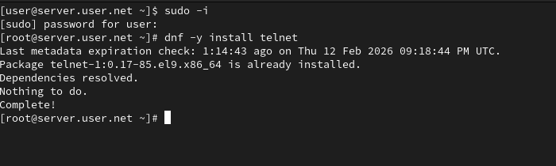{#fig-1 width=70%}

## Мониторинг почтовой службы

В дополнительном терминале запустим мониторинг работы почтовой службы (рис. @fig-2):

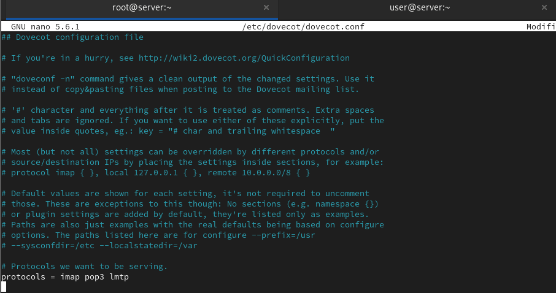{#fig-2 width=70%}

## Настройка LMTP в Dovecot

Добавим в список протоколов, с которыми может работать Dovecot, протокол LMTP (рис. @fig-3):

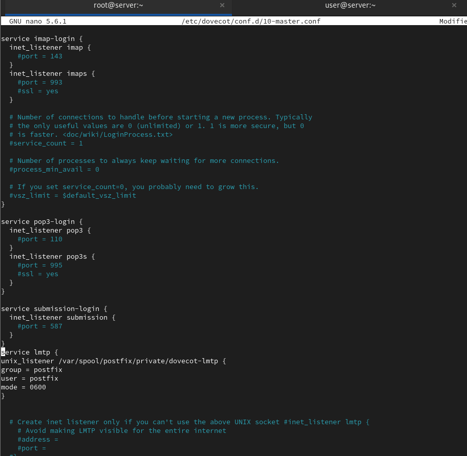{#fig-3 width=70%}

## Настройка сервиса lmtp

Настроим в Dovecot сервис lmtp для связи с Postfix, определив расположение unix-сокета и права доступа (рис. @fig-4):

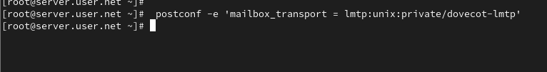{#fig-4 width=70%}

## Настройка Postfix для работы с LMTP

Переопределим в Postfix передачу сообщений через заданный unix-сокет (рис. @fig-5):

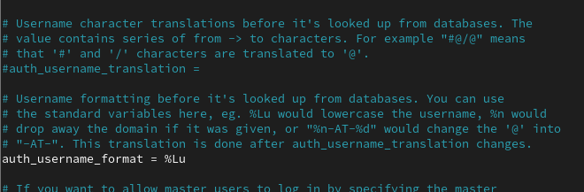{#fig-5 width=70%}

## Настройка формата аутентификации

В файле /etc/dovecot/conf.d/10-auth.conf зададим формат имени пользователя для аутентификации в форме логина без указания домена (рис. @fig-6):

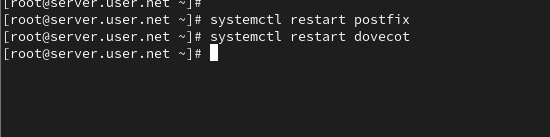{#fig-6 width=70%}

## Перезапуск служб

Перезапустим Postfix и Dovecot для применения изменений (рис. @fig-7):

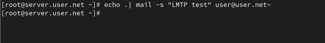{#fig-7 width=70%}

## Отправка тестового письма

Из-под учётной записи своего пользователя отправим письмо с клиента (рис. @fig-8):

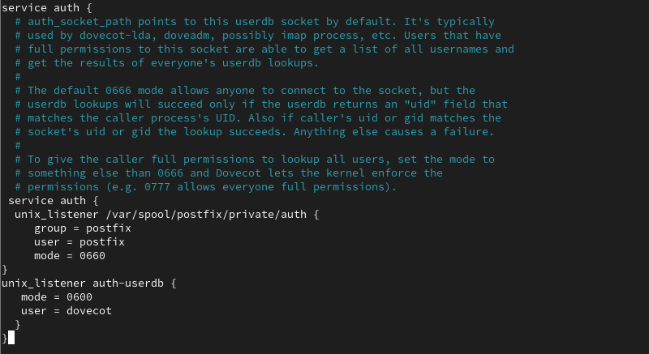{#fig-8 width=70%}

## Просмотр логов и почтового ящика

Посмотрим содержание логов при мониторинге почтовой службы и проверим почтовый ящик пользователя на сервере (рис. @fig-9, @fig-10):

{#fig-9 width=70%}

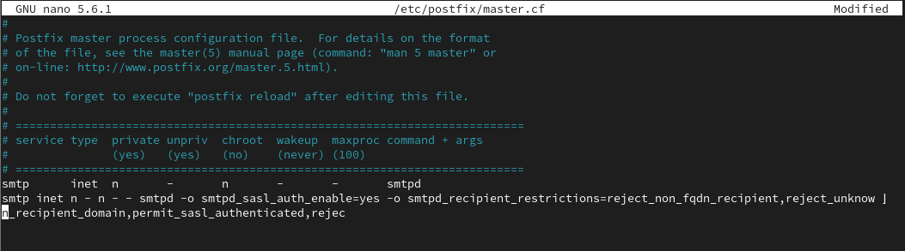{#fig-10 width=70%}

## Настройка аутентификации SASL

Определим службу аутентификации пользователей в Dovecot и настроим Postfix для использования SASL-аутентификации (рис. @fig-11):

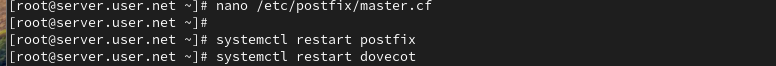{#fig-11 width=70%}

## Временный запуск SMTP с аутентификацией

Для проверки работы аутентификации временно запустим SMTP-сервер с возможностью аутентификации (рис. @fig-12):

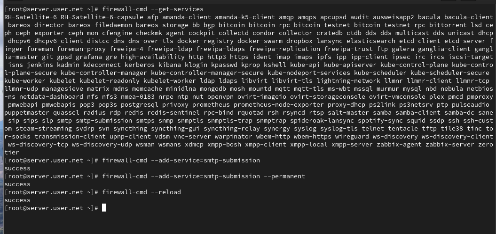{#fig-12 width=70%}

## Тестирование аутентификации через telnet

На клиенте установим telnet, получим строку для аутентификации и протестируем подключение к SMTP-серверу (рис. @fig-13):

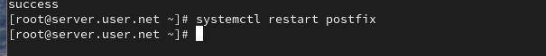{#fig-13 width=70%}

## Настройка SMTP на порту 587

Настроим SMTP-сервер на 587-м порту, разрешим соответствующую службу в межсетевом экране и перезапустим Postfix (рис. @fig-14):

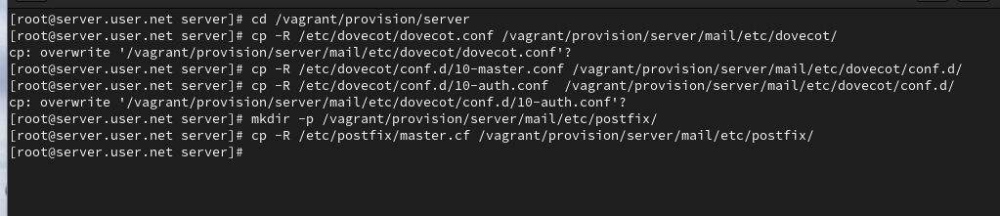{#fig-14 width=70%}

# Выводы

В ходе выполнения лабораторной работы были приобретены практические навыки по конфигурированию SMTP-сервера в части настройки аутентификации.

# Контрольные вопросы

1. **Приведите пример задания формата аутентификации пользователя в Dovecot в форме логина с указанием домена.**  
   В конфигурационном файле Dovecot (/etc/dovecot/conf.d/10-auth.conf) можно указать формат аутентификации следующим образом:
