# Цель работы

Целью данной работы является приобретение практических навыков по настройке удалённого доступа к серверу с помощью SSH.

# Выполнение лабораторной работы

## Настройка пароля для root

На сервере зададим пароль для пользователя root (рис. @fig-1):

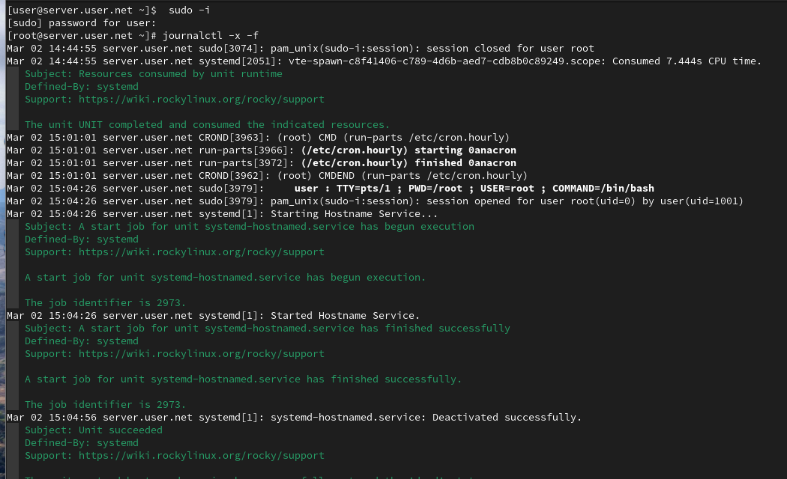{#fig-1 width=70%}

## Мониторинг системных событий

На сервере в дополнительном терминале запустим мониторинг системных событий (рис. @fig-2):

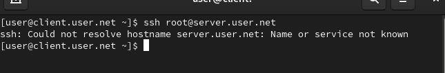{#fig-2 width=70%}

## Попытка доступа через root

С клиента попытаемся получить доступ к серверу посредством SSH-соединения через пользователя root (рис. @fig-3):

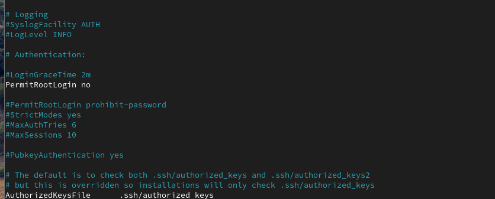{#fig-3 width=70%}

## Запрет входа для root

На сервере откроем файл /etc/ssh/sshd_config для редактирования и запретим вход на сервер пользователю root (рис. @fig-4):

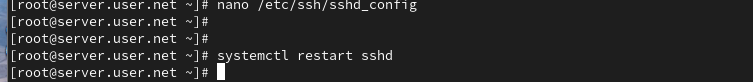{#fig-4 width=70%}

## Перезапуск sshd

После сохранения изменений перезапустим sshd (рис. @fig-5):

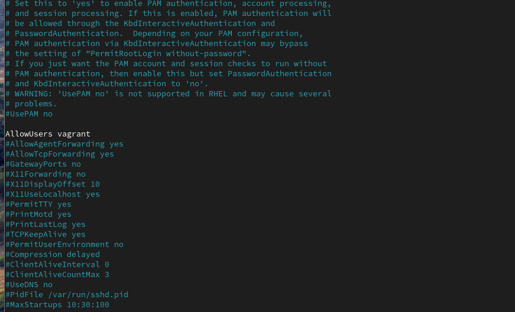{#fig-5 width=70%}

## Настройка AllowUsers

На сервере откроем файл /etc/ssh/sshd_config и добавим строку AllowUsers vagrant, затем перезапустим sshd (рис. @fig-6, @fig-7):

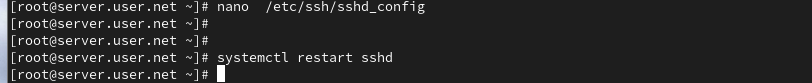{#fig-6 width=70%}

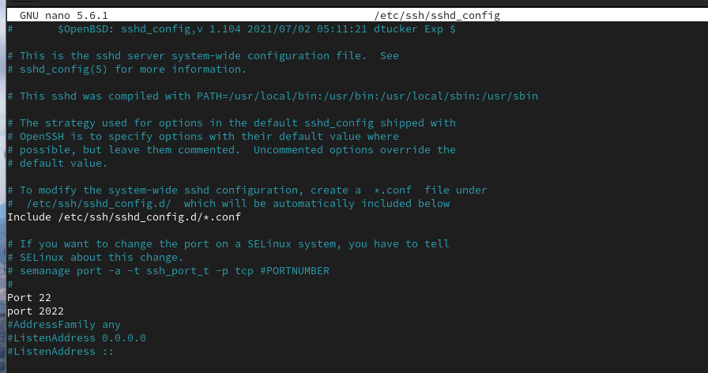{#fig-7 width=70%}

## Добавление пользователя в AllowUsers

Внесём изменение в файл /etc/ssh/sshd_config, добавив пользователя user в AllowUsers, и перезапустим sshd (рис. @fig-8, @fig-9):

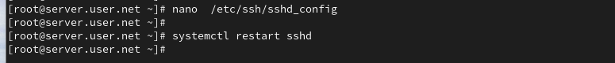{#fig-8 width=70%}

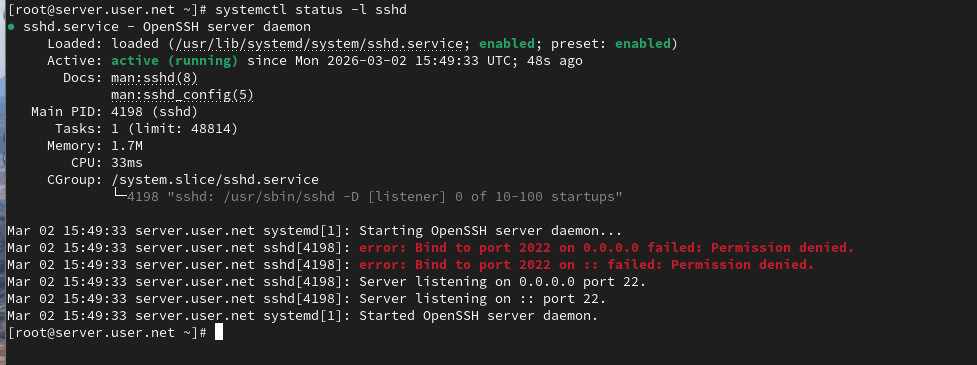{#fig-9 width=70%}

## Настройка нескольких портов

В файле /etc/ssh/sshd_config добавим второй порт 2022, перезапустим sshd и проверим статус (рис. @fig-10, @fig-11):

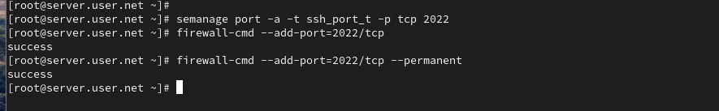{#fig-10 width=70%}

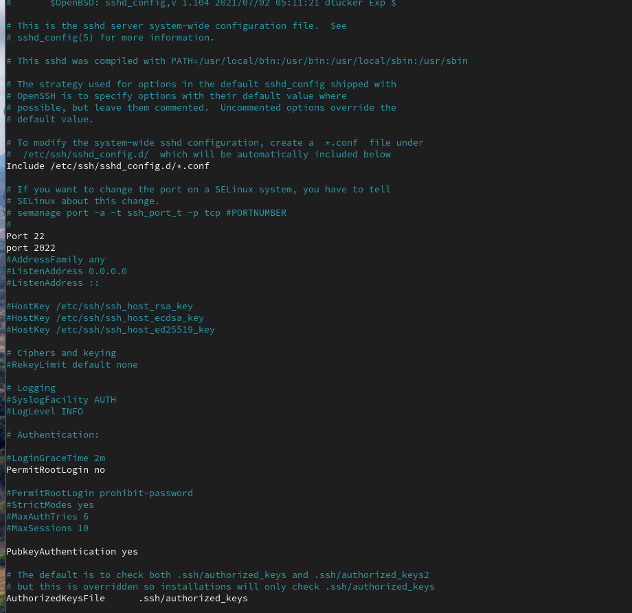{#fig-11 width=70%}

## Настройка SELinux и межсетевого экрана

Исправим метки SELinux для порта 2022 и откроем порт в межсетевом экране, затем перезапустим sshd (рис. @fig-12):

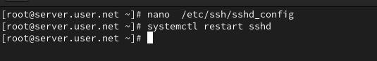{#fig-12 width=70%}

## Подключение через новый порт

С клиента подключимся к серверу через порт 2022 и получим доступ root (рис. @fig-13):

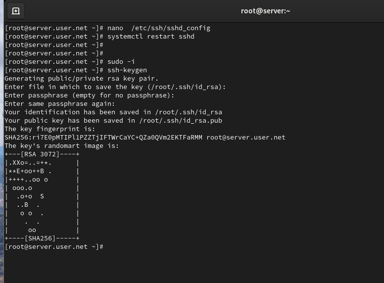{#fig-13 width=70%}

## Настройка аутентификации по ключу

На сервере разрешим аутентификацию по ключу и перезапустим sshd (рис. @fig-14):

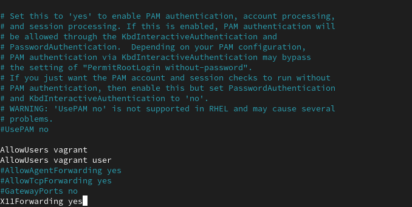{#fig-14 width=70%}

## Генерация и копирование ключа

На клиенте сформируем SSH-ключ и скопируем его на сервер (рис. @fig-15):

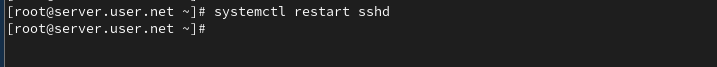{#fig-15 width=70%}

## Настройка перенаправления портов

На клиенте перенаправим порт 80 на сервере на порт 8080 локально и проверим запущенные службы (рис. @fig-16):

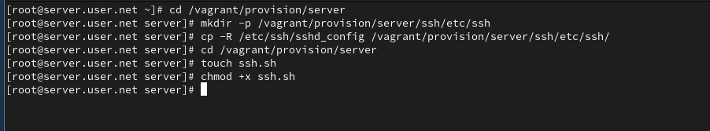{#fig-16 width=70%}

## Настройка X11 Forwarding

На сервере разрешим отображение графических интерфейсов X11 и перезапустим sshd (рис. @fig-17):

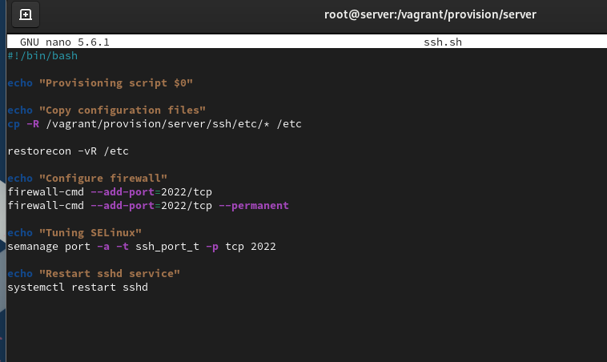{#fig-17 width=70%}

# Выводы

В ходе выполнения лабораторной работы были приобретены практические навыки по настройке удалённого доступа к серверу с помощью SSH.

# Контрольные вопросы

1. **Как запретить удалённый доступ по SSH пользователю root и разрешить доступ пользователю alice?**  
   В конфигурационном файле SSH /etc/ssh/sshd_config:
