# Цель работы

Целью данной работы является получение навыков по управлению системным временем и настройке синхронизации времени.

# Выполнение лабораторной работы

## Просмотр параметров времени на сервере

На сервере посмотрим параметры настройки даты и времени, текущего системного времени и аппаратного времени (рис. @fig-1):

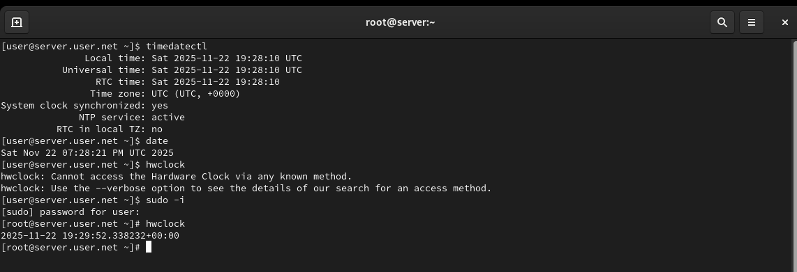{#fig-1 width=70%}

## Просмотр параметров времени на клиенте

На клиенте посмотрим параметры настройки даты и времени, текущего системного времени и аппаратного времени (рис. @fig-2):

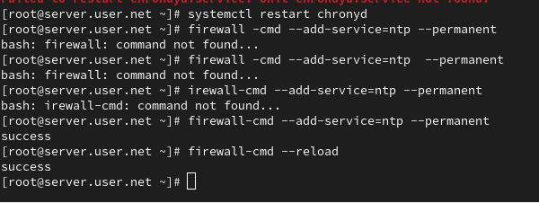{#fig-2 width=70%}

## Установка chrony на сервере

Установим на сервере необходимое программное обеспечение chrony (рис. @fig-3):

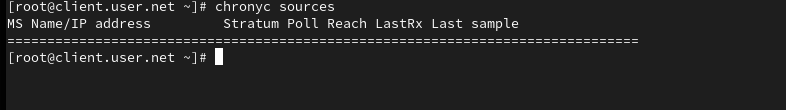{#fig-3 width=70%}

## Проверка источников времени на клиенте

Проверим источники времени на клиенте до настройки (рис. @fig-4):

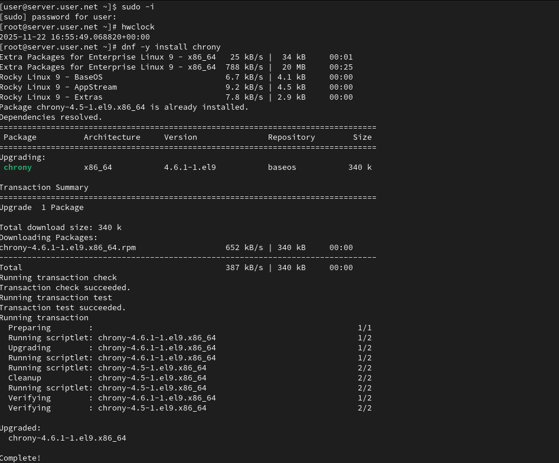{#fig-4 width=70%}

## Проверка источников времени на сервере

Проверим источники времени на сервере до настройки (рис. @fig-5):

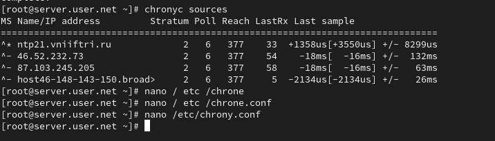{#fig-5 width=70%}

## Настройка конфигурации chrony на сервере

На сервере откроем на редактирование файл /etc/chrony.conf и добавим строку allow 192.168.0.0/16 (рис. @fig-6):

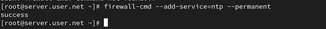{#fig-6 width=70%}

## Перезапуск chrony и настройка межсетевого экрана

На сервере перезапустим службу chronyd и настроим межсетевой экран (рис. @fig-7):

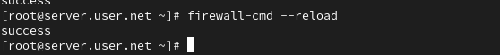{#fig-7 width=70%}

## Настройка конфигурации chrony на клиенте

На клиенте откроем файл /etc/chrony.conf и добавим строку server server.user.net iburst, удалив все остальные строки с директивой server (рис. @fig-8):

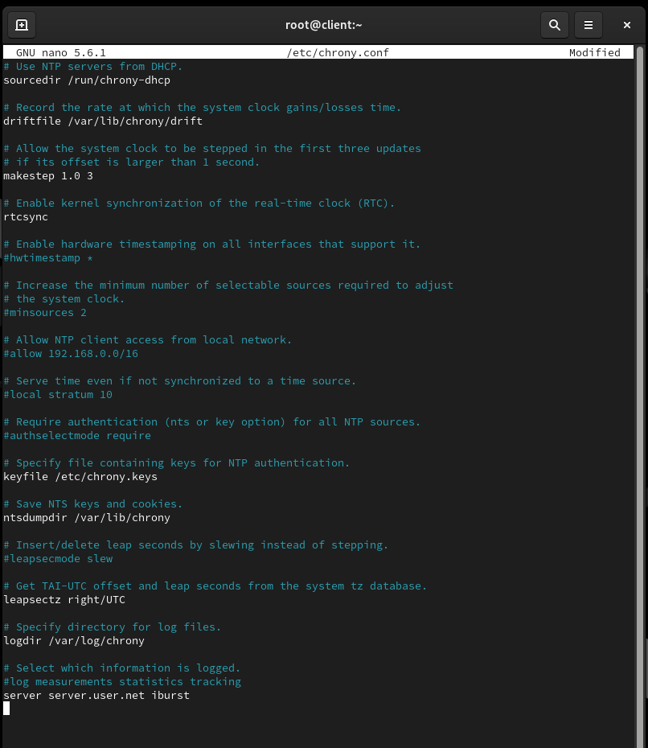{#fig-8 width=70%}

## Перезапуск chrony на клиенте

На клиенте перезапустим службу chronyd (рис. @fig-9):

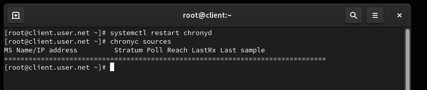{#fig-9 width=70%}

## Проверка источников времени на клиенте после настройки

Проверим источники времени на клиенте после настройки (рис. @fig-10):

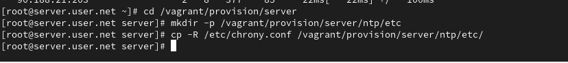{#fig-10 width=70%}

## Проверка источников времени на сервере после настройки

Проверим источники времени на сервере после настройки (рис. @fig-11):

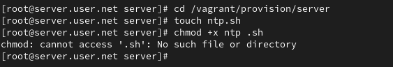{#fig-11 width=70%}

## Настройка автоматического развёртывания на сервере

На виртуальной машине server перейдём в каталог для внесения изменений в настройки внутреннего окружения, создадим каталог ntp и исполняемый файл ntp.sh (рис. @fig-12):

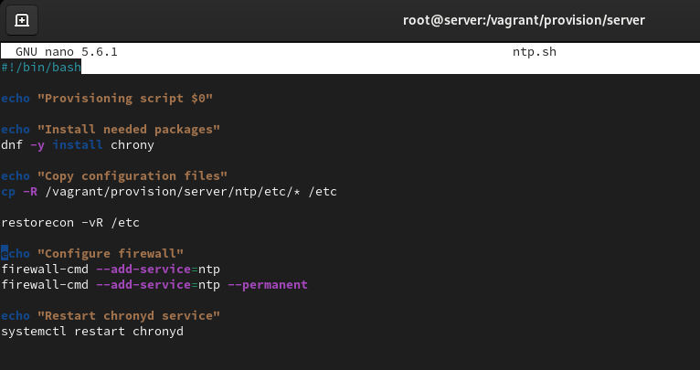{#fig-12 width=70%}

## Добавление скрипта в ntp.sh на сервере

Откроем файл ntp.sh на редактирование и пропишем скрипт из лабораторной работы (рис. @fig-13):

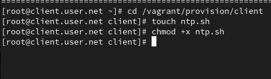{#fig-13 width=70%}

## Настройка автоматического развёртывания на клиенте

На виртуальной машине client перейдём в каталог для внесения изменений в настройки внутреннего окружения, создадим каталог ntp и исполняемый файл ntp.sh (рис. @fig-14):

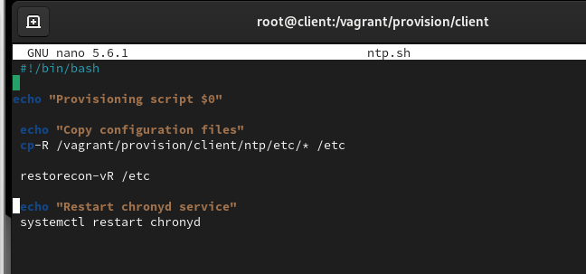{#fig-14 width=70%}

## Добавление скрипта в ntp.sh на клиенте

Откроем файл ntp.sh на редактирование и пропишем скрипт из лабораторной работы (рис. @fig-15):

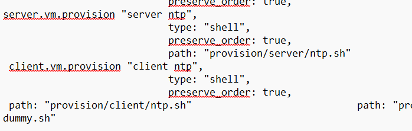{#fig-15 width=70%}

## Настройка Vagrantfile для сервера

Для отработки созданного скрипта во время загрузки виртуальной машины server в конфигурационном файле Vagrantfile добавим запись в разделе конфигурации для сервера (рис. @fig-16):

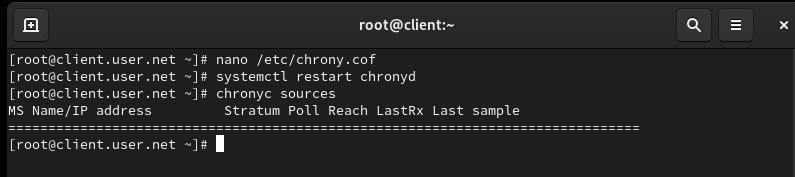{#fig-16 width=70%}

## Настройка Vagrantfile для клиента

Для отработки созданного скрипта во время загрузки виртуальной машины client в конфигурационном файле Vagrantfile добавим запись в разделе конфигурации для клиента (рис. @fig-17):

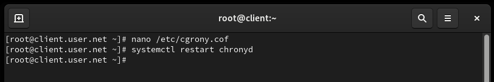{#fig-17 width=70%}

## Просмотр статуса chrony на сервере

Проверим статус синхронизации времени на сервере (рис. @fig-18):

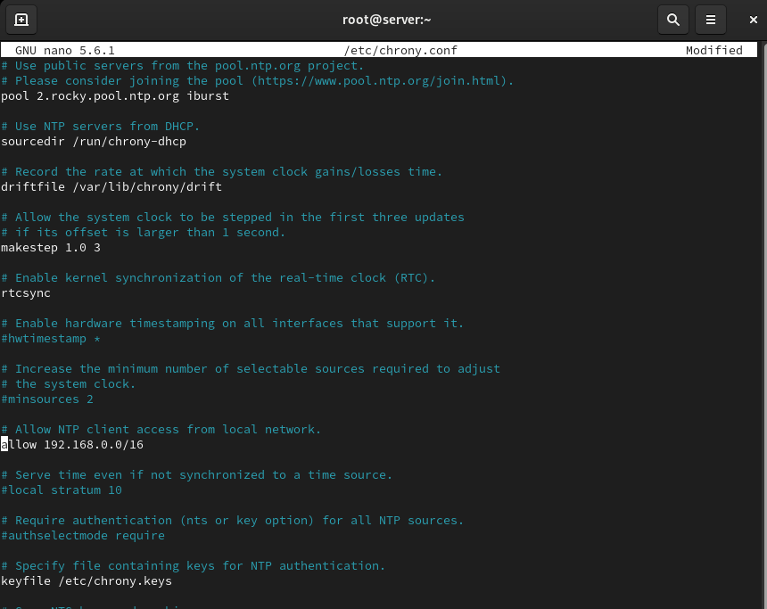{#fig-18 width=70%}

## Просмотр статуса chrony на клиенте

Проверим статус синхронизации времени на клиенте (рис. @fig-19):

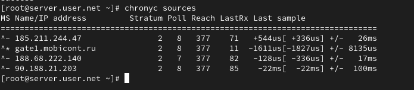{#fig-19 width=70%}

# Выводы

В ходе выполнения лабораторной работы были получены навыки по управлению системным временем и настройке синхронизации времени.

# Контрольные вопросы

1. **Почему важна точная синхронизация времени для служб баз данных?**  
   Синхронизация времени необходима для обеспечения корректности временных меток в базе данных. Распределенные системы баз данных чувствительны к разнице во времени между узлами, и несогласованность времени может привести к проблемам с транзакциями и целостностью данных.

2. **Почему служба проверки подлинности Kerberos сильно зависит от правильной синхронизации времени?**  
   Kerberos использует временные метки для предотвращения атак воспроизведения билетов. Если время не синхронизировано, билеты могут быть считаны как недействительные, что приведет к проблемам с аутентификацией.

3. **Какая служба используется по умолчанию для синхронизации времени на RHEL 7?**  
   На RHEL 7 служба синхронизации времени по умолчанию - chrony.

4. **Какова страта по умолчанию для локальных часов?**  
   Страта 0 (нулевая) - локальные часы, являющиеся источником времени.

5. **Какой порт брандмауэра должен быть открыт, если вы настраиваете свой сервер как одноранговый узел NTP?**  
   Порт 123 (UDP) должен быть открыт для протокола NTP.

6. **Какую строку вам нужно включить в конфигурационный файл chrony, если вы хотите быть сервером времени, даже если внешние серверы NTP недоступны?**  
   В конфигурационном файле /etc/chrony.conf добавьте строку: `local stratum 10`

7. **Какую страту имеет хост, если нет текущей синхронизации времени NTP?**  
   Страта 16 - хост без синхронизации времени NTP.

8. **Какую команду вы бы использовали на сервере с chrony, чтобы узнать, с какими серверами он синхронизируется?**  
   `chronyc sources -v`

9. **Как вы можете получить подробную статистику текущих настроек времени для процесса chrony вашего сервера?**  
   `chronyc tracking` - эта команда предоставляет подробную информацию о текущей синхронизации времени, дисперсии, коррекции часов и других параметрах.
