# Цель работы

Целью данной работы является приобретение навыков настройки сервера NFS для удалённого доступа к ресурсам.

# Выполнение лабораторной работы

## Установка NFS на сервере

На сервере установим необходимое программное обеспечение nfs-utils (рис. @fig-1):

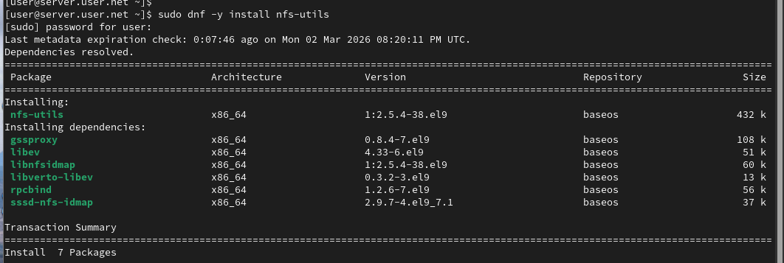{#fig-1 width=70%}

## Создание корневого каталога NFS

На сервере создадим каталог, который предполагается сделать доступным всем пользователям сети (корень дерева NFS) (рис. @fig-2):

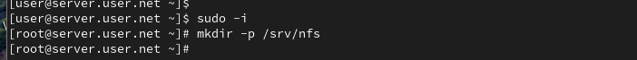{#fig-2 width=70%}

## Настройка экспорта каталога

В файле /etc/exports пропишем подключаемый через NFS общий каталог с доступом только на чтение (рис. @fig-3):

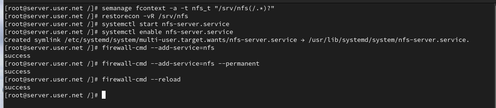{#fig-3 width=70%}

## Настройка SELinux и запуск сервера

Для общего каталога зададим контекст безопасности NFS, применим изменённую настройку SELinux, запустим сервер NFS и настроим межсетевой экран (рис. @fig-4):

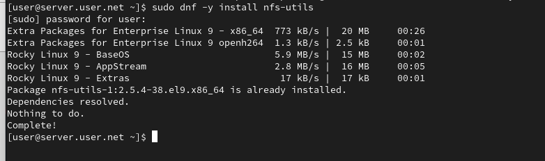{#fig-4 width=70%}

## Установка NFS на клиенте

На клиенте установим необходимое для работы NFS программное обеспечение (рис. @fig-5):

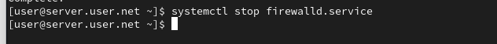{#fig-5 width=70%}

## Просмотр удалённых ресурсов

На клиенте попробуем посмотреть имеющиеся подмонтированные удалённые ресурсы (рис. @fig-6):

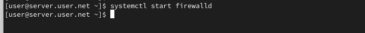{#fig-6 width=70%}

## Остановка межсетевого экрана

Попробуем на сервере остановить сервис межсетевого экрана (рис. @fig-7):

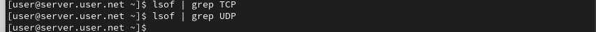{#fig-7 width=70%}

## Запуск межсетевого экрана

На сервере запустим сервис межсетевого экрана (рис. @fig-8):

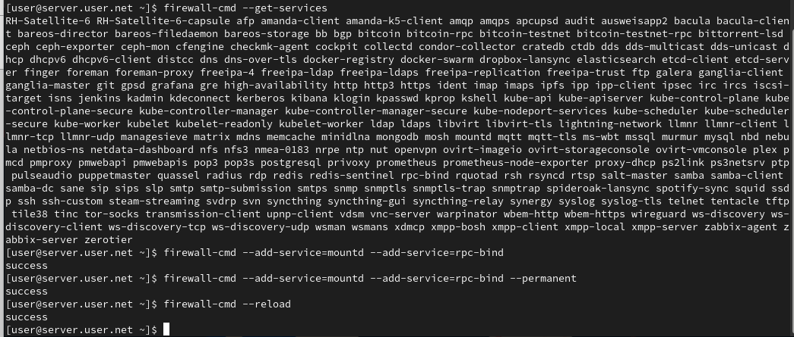{#fig-8 width=70%}

## Просмотр служб NFS

На сервере посмотрим, какие службы задействованы при удалённом монтировании (TCP и UDP) (рис. @fig-9, @fig-10):

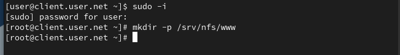{#fig-9 width=70%}

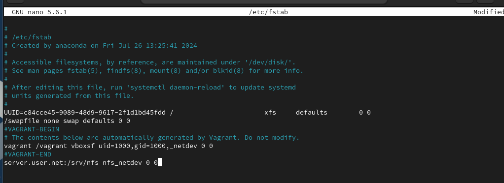{#fig-10 width=70%}

## Добавление служб в межсетевой экран

Добавим службы rpc-bind и mountd в настройки межсетевого экрана на сервере (рис. @fig-11):

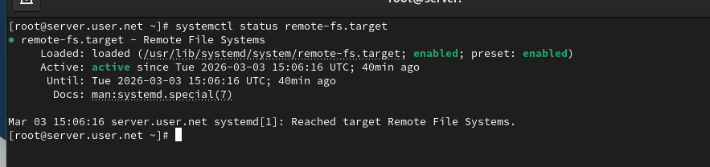{#fig-11 width=70%}

## Монтирование NFS на клиенте

На клиенте создадим каталог для монтирования удалённого ресурса и подмонтируем дерево NFS. Проверим, что общий ресурс подключён правильно (рис. @fig-12):

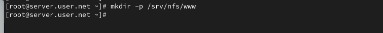{#fig-12 width=70%}

## Настройка автоматического монтирования

На клиенте в конце файла /etc/fstab добавим запись для автоматического монтирования NFS при загрузке (рис. @fig-13):

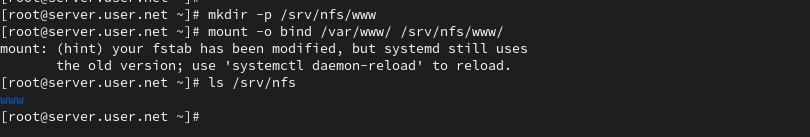{#fig-13 width=70%}

## Проверка автоматического монтирования

На клиенте проверим наличие автоматического монтирования удалённых ресурсов при запуске системы (рис. @fig-14):

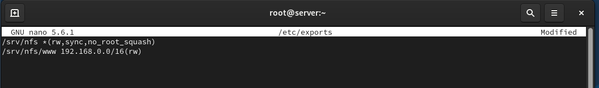{#fig-14 width=70%}

## Создание каталога для веб-контента

На сервере создадим общий каталог, в который затем будет подмонтирован каталог с контентом веб-сервера (рис. @fig-15):

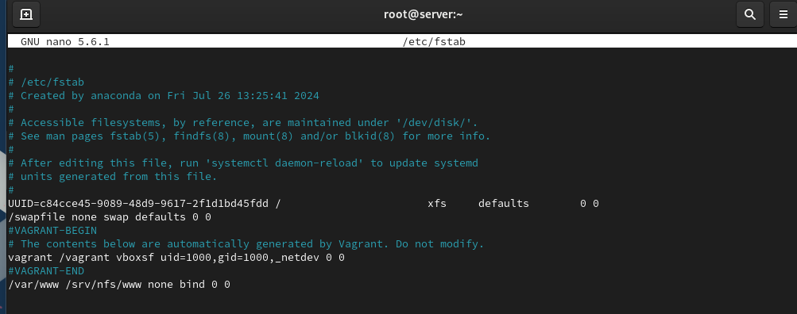{#fig-15 width=70%}

## Монтирование веб-каталога

Подмонтируем каталог веб-сервера и проверим содержимое каталога /srv/nfs (рис. @fig-16):

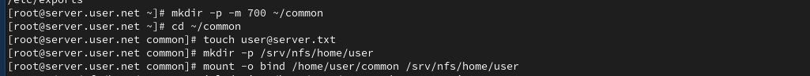{#fig-16 width=70%}

## Экспорт веб-каталога

На сервере в файле /etc/exports добавим экспорт каталога веб-сервера с удалённого ресурса (рис. @fig-17):

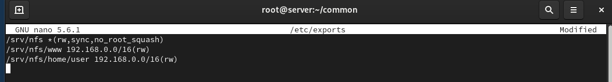{#fig-17 width=70%}

## Настройка автоматического монтирования веб-каталога

На сервере в конце файла /etc/fstab добавим запись для автоматического монтирования веб-каталога (рис. @fig-18):

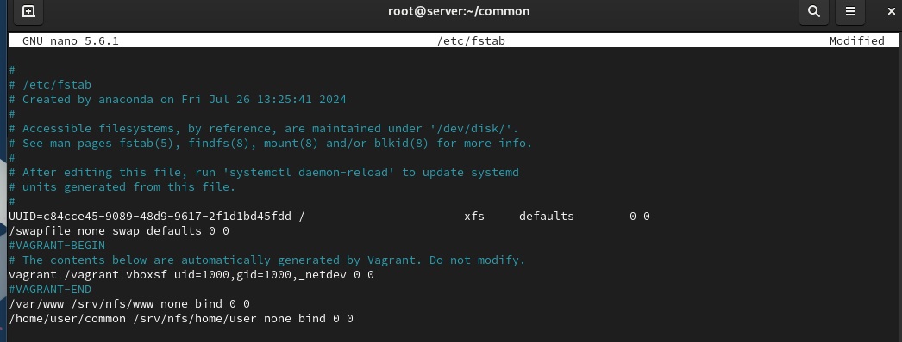{#fig-18 width=70%}

## Создание пользовательского каталога

На сервере под пользователем user создадим каталог common и файл user@server.txt. Подмонтируем его в NFS (рис. @fig-19):

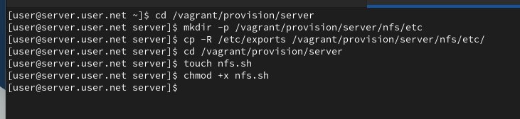{#fig-19 width=70%}

## Экспорт пользовательского каталога

Подключим каталог пользователя в файле /etc/exports (рис. @fig-20):

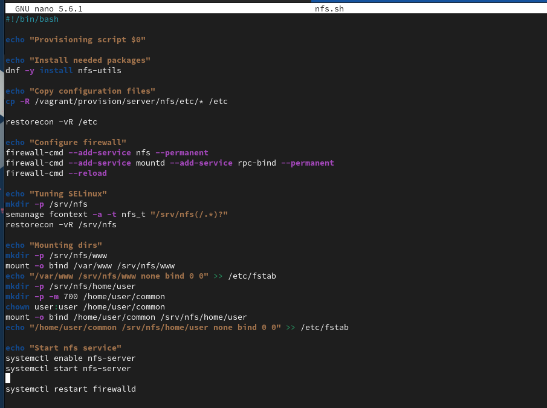{#fig-20 width=70%}

## Настройка автоматического монтирования пользовательского каталога

Внесём изменения в файл /etc/fstab для автоматического монтирования пользовательского каталога (рис. @fig-21):

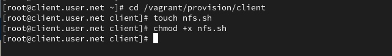{#fig-21 width=70%}

## Проверка доступа на клиенте

На клиенте под пользователем user попробуем создать файл в подмонтированном каталоге (рис. @fig-22):

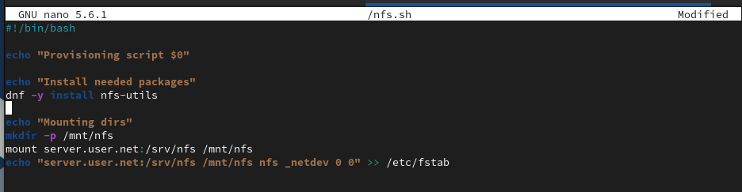{#fig-22 width=70%}

# Выводы

В ходе выполнения лабораторной работы были приобретены навыки настройки сервера NFS для удалённого доступа к ресурсам.

# Контрольные вопросы

1. **Как называется файл конфигурации, содержащий общие ресурсы NFS?**  
   Файл конфигурации, содержащий общие ресурсы NFS, называется `/etc/exports`. В этом файле определяются каталоги, которые будут доступны для общего использования через NFS.

2. **Какие порты должны быть открыты в брандмауэре, чтобы обеспечить полный доступ к серверу NFS?**  
   Для обеспечения полного доступа к серверу NFS, обычно открываются следующие порты:
   - TCP и UDP порт 2049: Основной порт для NFS.
   - TCP и UDP порт 111: Порт для службы rpcbind.
   - Порты для динамически выделяемых портов (обычно в диапазоне 32768-32779), используемых NFS для передачи данных.

3. **Какую опцию следует использовать в /etc/fstab, чтобы убедиться, что общие ресурсы NFS могут быть установлены автоматически при перезагрузке?**  
   Для автоматической установки общих ресурсов NFS при загрузке системы, в файле /etc/fstab следует использовать опцию `auto`. Пример строки:
