# Цель работы

Целью данной работы является приобретение навыков настройки доступа групп пользователей к общим ресурсам по протоколу SMB.

# Выполнение лабораторной работы

## Установка Samba на сервере

На сервере установим необходимые пакеты samba, samba-client и cifs-utils (рис. @fig-1):

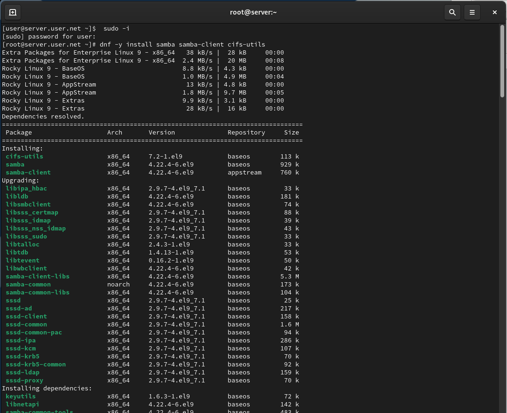{#fig-1 width=70%}

## Создание группы и каталога

Создадим группу sambagroup для пользователей, добавлем пользователя и создадим общий каталог (рис. @fig-2):

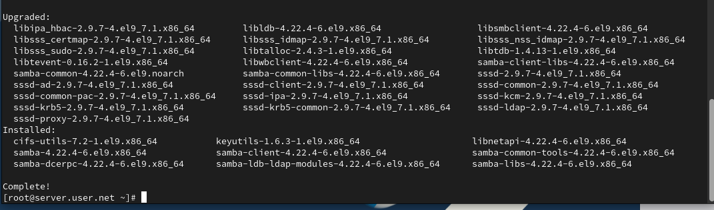{#fig-2 width=70%}

## Настройка рабочей группы

В файле конфигурации /etc/samba/smb.conf изменим параметр рабочей группы (рис. @fig-3):

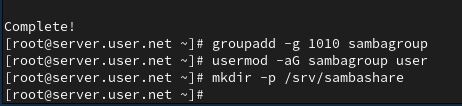{#fig-3 width=70%}

## Добавление общего ресурса

В конце файла добавим раздел с описанием общего доступа к разделяемому ресурсу (рис. @fig-4):

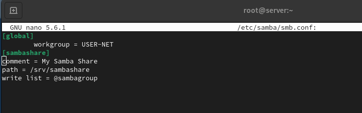{#fig-4 width=70%}

## Проверка синтаксиса

Убедимся, что мы не сделали синтаксических ошибок в файле smb.conf, используя команду testparm (рис. @fig-5):

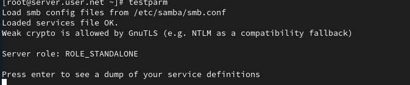{#fig-5 width=70%}

## Запуск демона Samba

Запустим демон Samba и посмотрим его статус (рис. @fig-6):

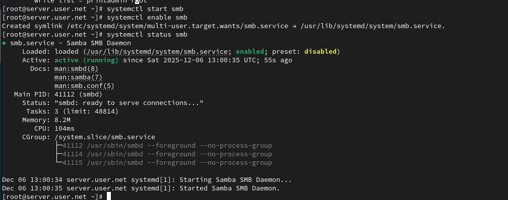{#fig-6 width=70%}

## Проверка общего доступа

Для проверки наличия общего доступа попробуем подключиться к серверу с помощью smbclient (рис. @fig-7):

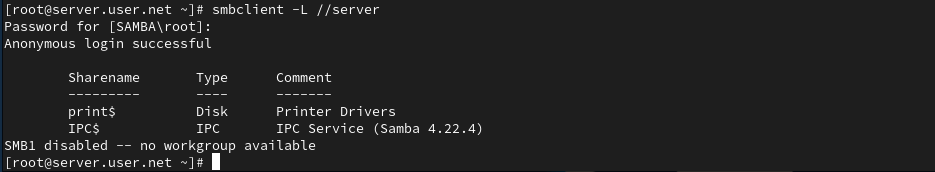{#fig-7 width=70%}

## Настройка межсетевого экрана

Посмотрим файл конфигурации межсетевого экрана для Samba и настроим его (рис. @fig-8):

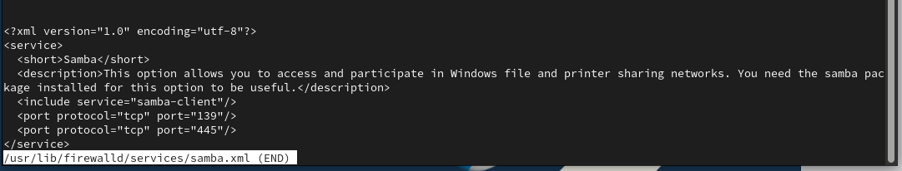{#fig-8 width=70%}

## Настройка прав доступа и SELinux

Настроим права доступа для каталога с разделяемым ресурсом, контекст безопасности SELinux и добавим пользователя в базу Samba (рис. @fig-9):

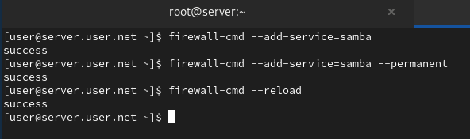{#fig-9 width=70%}

## Установка клиентских пакетов

На клиенте установим необходимые пакеты samba-client и cifs-utils (рис. @fig-10):

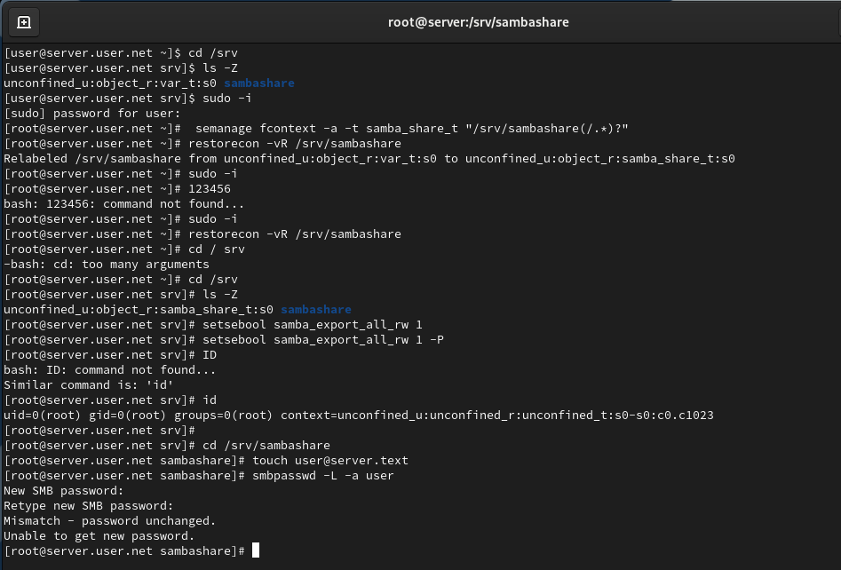{#fig-10 width=70%}

## Настройка клиента

На клиенте настроим межсетевой экран, создадим группу и изменим рабочую группу (рис. @fig-11):

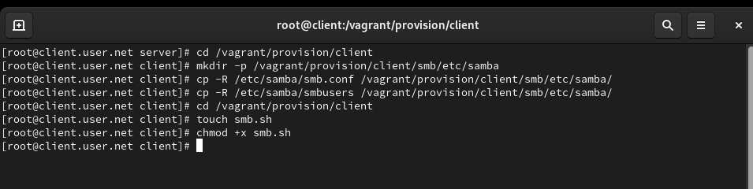{#fig-11 width=70%}

## Создание файла учётных данных

Создадим файл smbusers в каталоге /etc/samba/ для настройки работы с Samba с помощью файла учётных данных (рис. @fig-12):

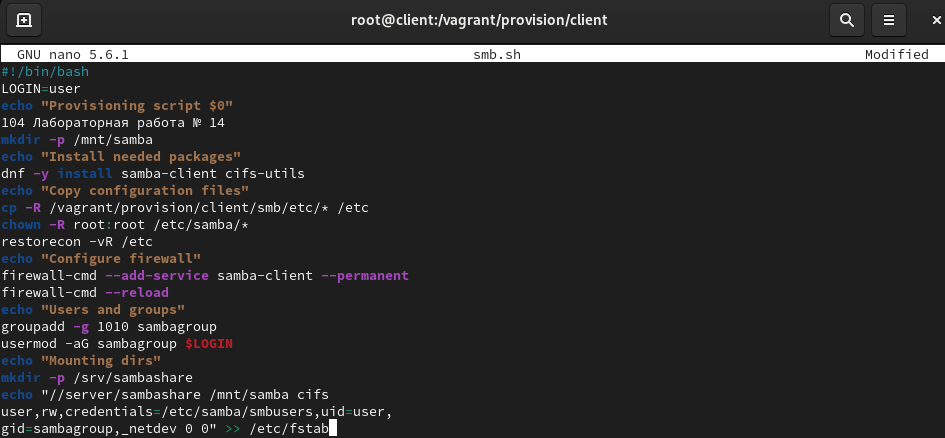{#fig-12 width=70%}

## Монтирование общего ресурса

Добавим строку в /etc/fstab и подмонтируем общий ресурс (рис. @fig-13):

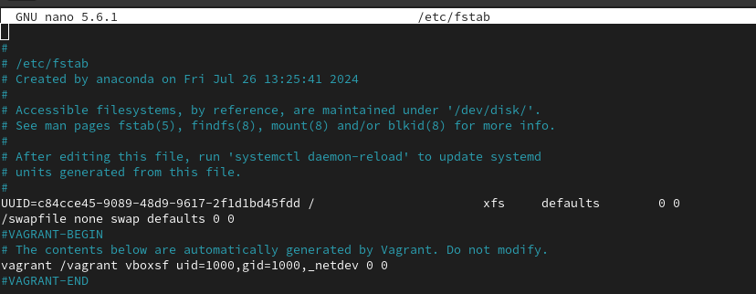{#fig-13 width=70%}

# Выводы

В ходе выполнения лабораторной работы были приобретены навыки настройки доступа групп пользователей к общим ресурсам по протоколу SMB.

# Контрольные вопросы

1. **Какова минимальная конфигурация для smb.conf для создания общего ресурса, который предоставляет доступ к каталогу /data?**  
