# Цель работы

Целью данной работы является получение навыков по работе с журналами системных событий.

# Выполнение лабораторной работы

## Настройка сервера для приёма журналов

На сервере создадим файл конфигурации сетевого хранения журналов в каталоге /etc/rsyslog.d (рис. @fig-1):

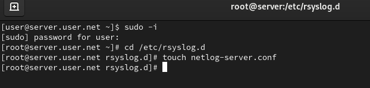{#fig-1 width=70%}

## Настройка приёма записей по TCP

В файле конфигурации /etc/rsyslog.d/netlog-server.conf включим приём записей журнала по TCP-порту 514 (рис. @fig-2):

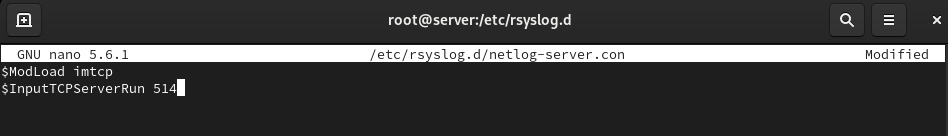{#fig-2 width=70%}

## Перезапуск rsyslog и проверка портов

Перезапустим службу rsyslog и посмотрим, какие порты, связанные с rsyslog, прослушиваются (рис. @fig-3):

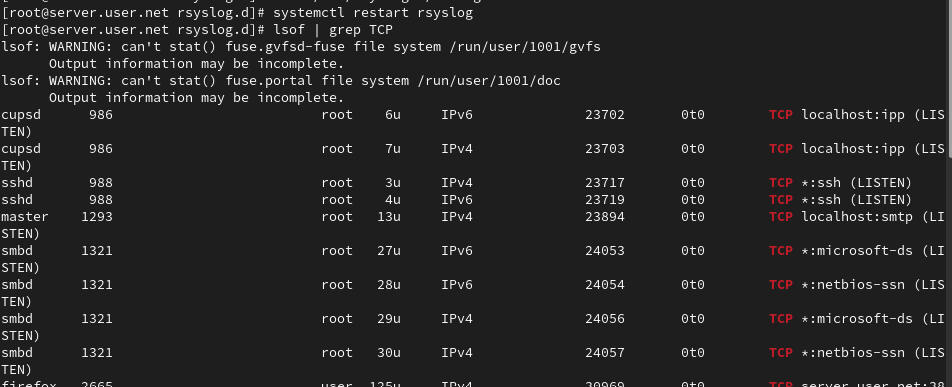{#fig-3 width=70%}

## Настройка межсетевого экрана на сервере

На сервере настроим межсетевой экран для приёма сообщений по TCP-порту 514 (рис. @fig-4):

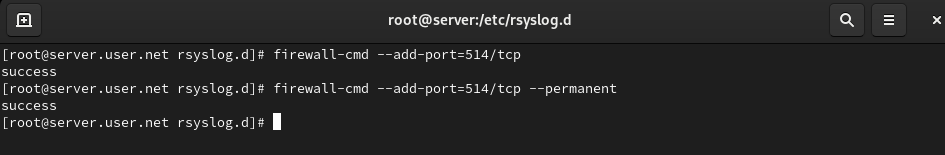{#fig-4 width=70%}

## Настройка клиента для отправки журналов

На клиенте создадим файл конфигурации сетевого хранения журналов (рис. @fig-5):

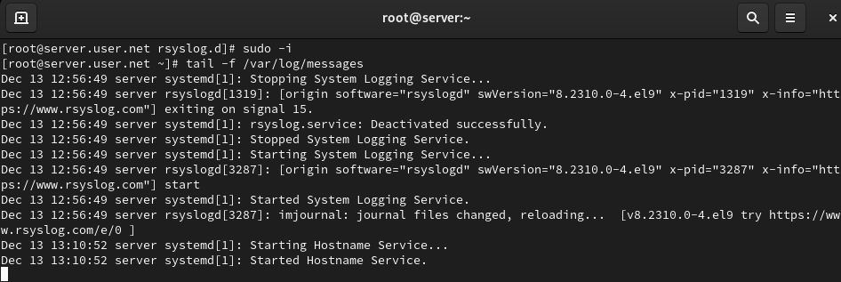{#fig-5 width=70%}

## Настройка перенаправления сообщений

В файле конфигурации /etc/rsyslog.d/netlog-client.conf включим перенаправление сообщений журнала на 514 TCP-порт сервера (рис. @fig-6):

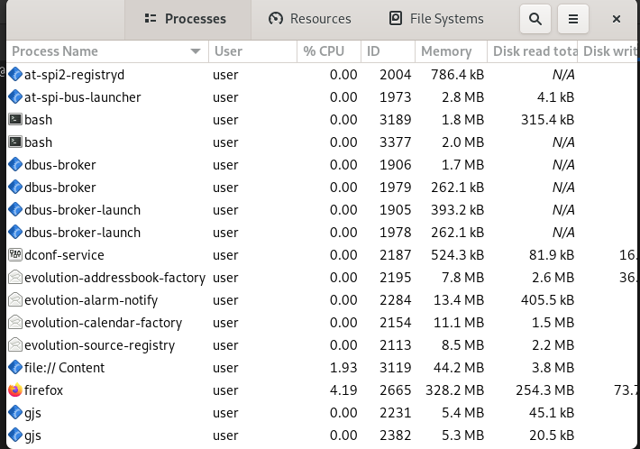{#fig-6 width=70%}

## Перезапуск rsyslog на клиенте

Перезапустим службу rsyslog на клиенте для применения изменений (рис. @fig-7):

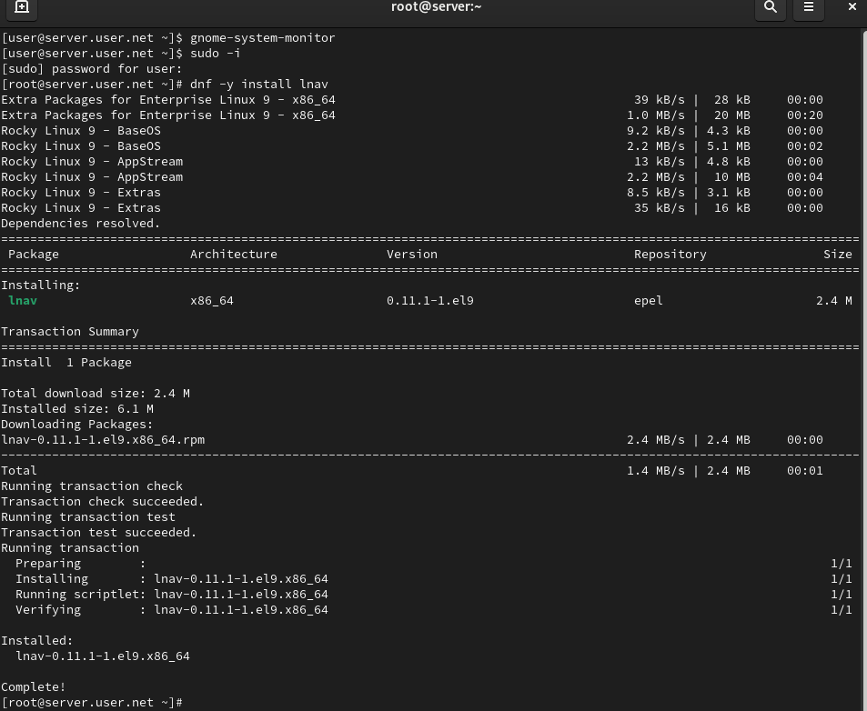{#fig-7 width=70%}

## Просмотр журналов на сервере

На сервере просмотрим один из файлов журнала для проверки сбора сообщений (рис. @fig-8):

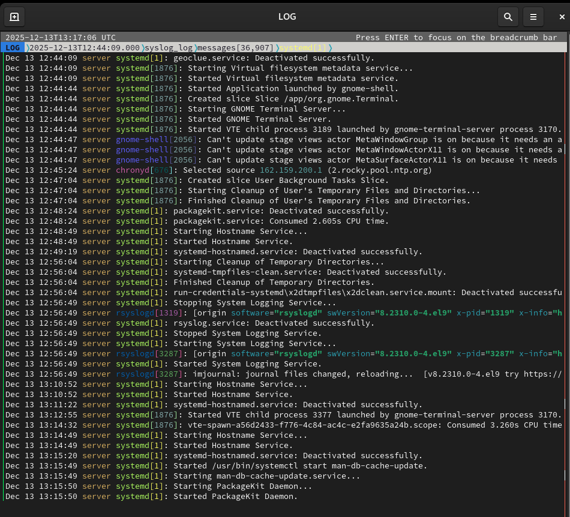{#fig-8 width=70%}

## Использование графической программы для просмотра журналов

На сервере под пользователем запустим графическую программу для просмотра журналов gnome-system-monitor (рис. @fig-9):

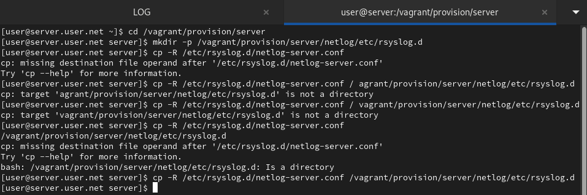{#fig-9 width=70%}

## Установка lnav

На сервере установим просмотрщик журналов системных сообщений lnav (рис. @fig-10):

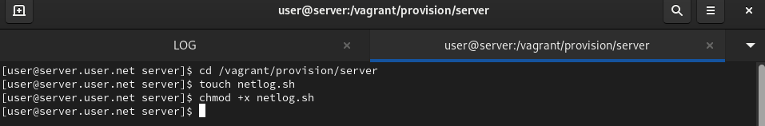{#fig-10 width=70%}

## Просмотр логов с помощью lnav

Просмотрим логи с помощью lnav для удобного анализа системных сообщений (рис. @fig-11):

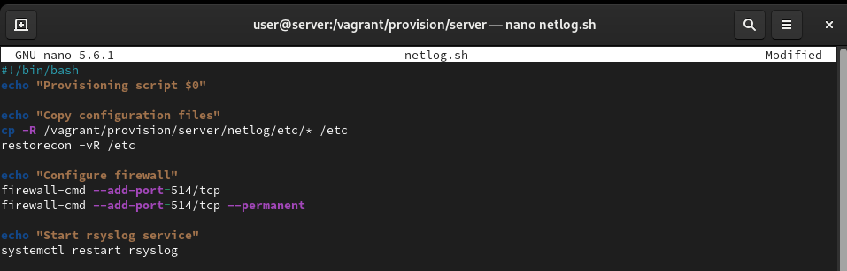{#fig-11 width=70%}

## Настройка автоматического развёртывания на сервере

На виртуальной машине server перейдём в каталог для внесения изменений в настройки внутреннего окружения, создадим каталог netlog и исполняемый файл netlog.sh (рис. @fig-12):

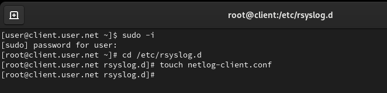{#fig-12 width=70%}

## Добавление скрипта в netlog.sh на сервере

Откроем файл netlog.sh на редактирование и пропишем скрипт из лабораторной работы (рис. @fig-13):

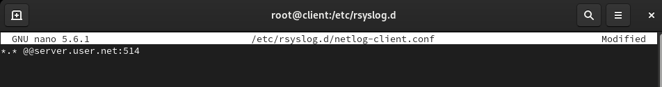{#fig-13 width=70%}

## Настройка автоматического развёртывания на клиенте

На виртуальной машине client перейдём в каталог для внесения изменений в настройки внутреннего окружения, создадим каталог netlog и исполняемый файл netlog.sh (рис. @fig-14):

{#fig-14 width=70%}

## Добавление скрипта в netlog.sh на клиенте

Откроем файл netlog.sh на редактирование и пропишем скрипт из лабораторной работы (рис. @fig-15):

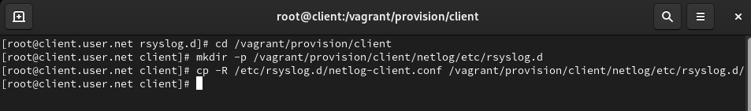{#fig-15 width=70%}

## Настройка Vagrantfile для сервера

Для отработки созданного скрипта во время загрузки виртуальной машины server в конфигурационном файле Vagrantfile добавим запись в разделе конфигурации для сервера (рис. @fig-16):

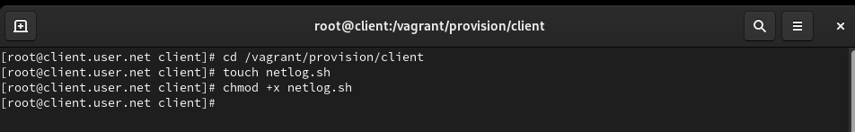{#fig-16 width=70%}

## Настройка Vagrantfile для клиента

Для отработки созданного скрипта во время загрузки виртуальной машины client в конфигурационном файле Vagrantfile добавим запись в разделе конфигурации для клиента (рис. @fig-17):

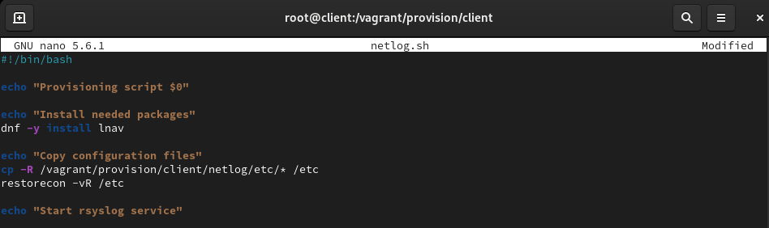{#fig-17 width=70%}

## Проверка сбора журналов на сервере

Проверим, что журналы с клиента успешно собираются на сервере (рис. @fig-18):

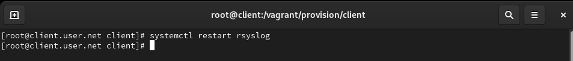{#fig-18 width=70%}

## Мониторинг системных событий

Запустим мониторинг системных событий для наблюдения за работой службы (рис. @fig-19):

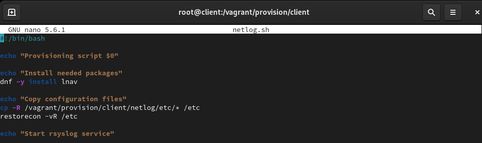{#fig-19 width=70%}

# Выводы

В ходе выполнения лабораторной работы были получены навыки по работе с журналами системных событий.

# Контрольные вопросы

1. **Какой модуль rsyslog вы должны использовать для приёма сообщений от journald?**  
   Для приёма сообщений от journald в rsyslog используется модуль imjournal.

2. **Как называется устаревший модуль, который можно использовать для включения приёма сообщений журнала в rsyslog?**  
   Устаревший модуль для приема сообщений журнала в rsyslog - imuxsock (или imuxsock_legacy).

3. **Чтобы убедиться, что устаревший метод приёма сообщений из journald в rsyslog не используется, какой дополнительный параметр следует использовать?**  
   Для предотвращения использования устаревшего метода можно использовать параметр `SystemMaxUseForward=no` в файле /etc/systemd/journald.conf.

4. **В каком конфигурационном файле содержатся настройки, которые позволяют вам настраивать работу журнала?**  
   Настройки, позволяющие настроить работу журнала, содержатся в файле /etc/systemd/journald.conf.

5. **Каким параметром управляется пересылка сообщений из journald в rsyslog?**  
   Для управления пересылкой сообщений из journald в rsyslog используется параметр `ForwardToSyslog=yes` в файле /etc/systemd/journald.conf.

6. **Какой модуль rsyslog вы можете использовать для включения сообщений из файла журнала, не созданного rsyslog?**  
   Для включения сообщений из файла журнала, не созданного rsyslog, используется модуль imfile.

7. **Какой модуль rsyslog вам нужно использовать для пересылки сообщений в базу данных MariaDB?**  
   Для пересылки сообщений в базу данных MariaDB используется модуль ommysql или ommysqlps.

8. **Какие две строки вам нужно включить в rsyslog.conf, чтобы позволить текущему журнальному серверу получать сообщения через TCP?**  
   Добавьте следующие строки в rsyslog.conf:
