# Цель работы

Целью данной работы является получение навыков работы с программным средством Fail2ban для обеспечения базовой защиты от атак типа «brute force».

# Выполнение лабораторной работы

## Установка Fail2ban

На сервере установим fail2ban (рис. @fig-1):

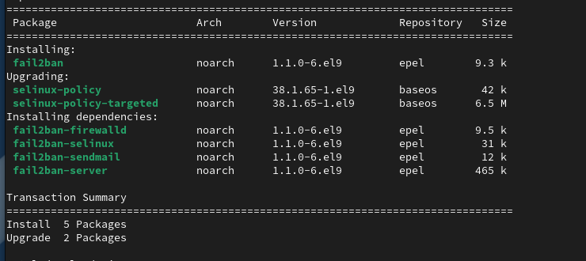{#fig-1 width=70%}

## Запуск сервера Fail2ban

Запустим сервер fail2ban и добавим его в автозагрузку (рис. @fig-2):

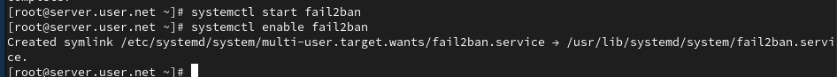{#fig-2 width=70%}

## Мониторинг журнала событий

В дополнительном терминале запустим просмотр журнала событий fail2ban (рис. @fig-3):

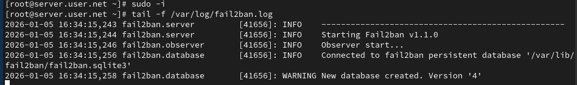{#fig-3 width=70%}

## Создание локальной конфигурации

Создадим файл с локальной конфигурацией fail2ban (рис. @fig-4):

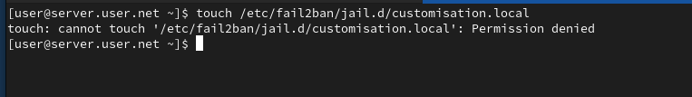{#fig-4 width=70%}

## Настройка защиты SSH

В файле /etc/fail2ban/jail.d/customisation.local зададим время блокирования на 1 час и включим защиту SSH (рис. @fig-5):

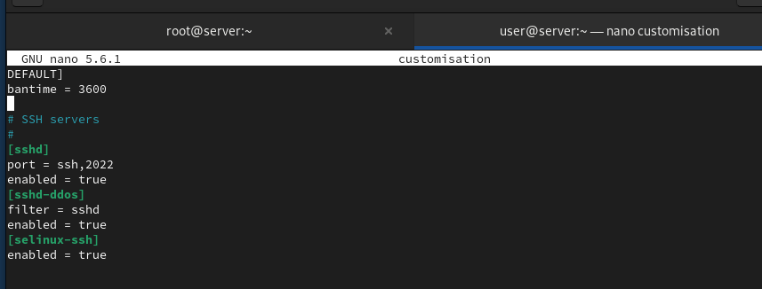{#fig-5 width=70%}

## Перезапуск fail2ban

Перезапустим fail2ban для применения изменений (рис. @fig-6):

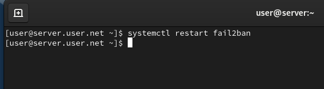{#fig-6 width=70%}

## Просмотр журнала событий

Посмотрим журнал событий после перезапуска (рис. @fig-7):

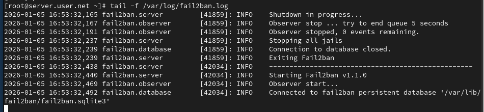{#fig-7 width=70%}

## Настройка защиты HTTP

В файле /etc/fail2ban/jail.d/customisation.local включим защиту HTTP (рис. @fig-8):

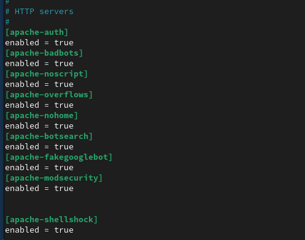{#fig-8 width=70%}

## Перезапуск и проверка

Перезапустим fail2ban и проверим журнал событий (рис. @fig-9, @fig-10):

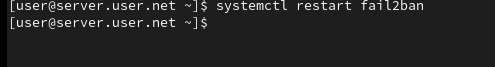{#fig-9 width=70%}

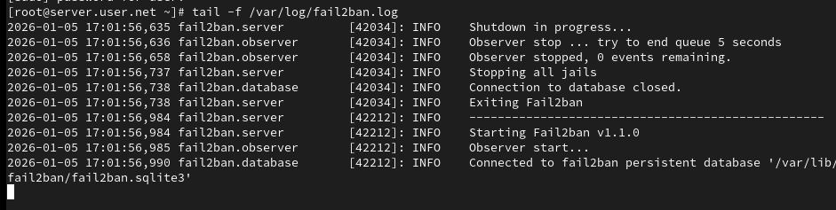{#fig-10 width=70%}

## Настройка защиты почты

В файле /etc/fail2ban/jail.d/customisation.local включим защиту почты (рис. @fig-11):

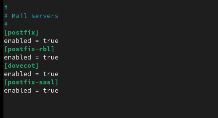{#fig-11 width=70%}

## Перезапуск и финальная проверка

Перезапустим fail2ban и посмотрим журнал событий (рис. @fig-12, @fig-13):

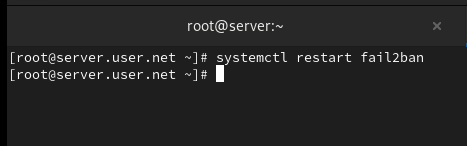{#fig-12 width=70%}

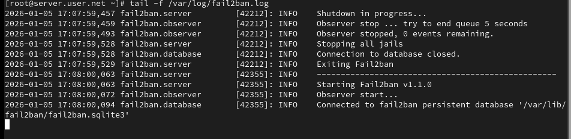{#fig-13 width=70%}

## Управление блокировками

На сервере посмотрим статус защиты SSH и разблокируем IP-адрес клиента (рис. @fig-14):

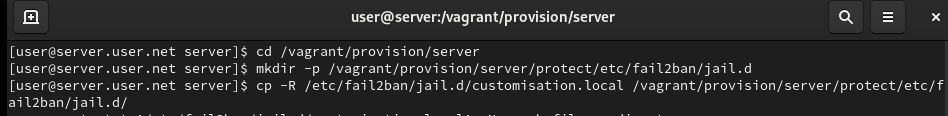{#fig-14 width=70%}

## Настройка игнорирования адреса

Внесём изменение в конфигурационный файл, добавив игнорирование адреса клиента, и перезапустим fail2ban (рис. @fig-15):

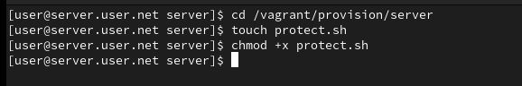{#fig-15 width=70%}

# Выводы

В ходе выполнения лабораторной работы были получены навыки работы с программным средством Fail2ban для обеспечения базовой защиты от атак типа «brute force».

# Контрольные вопросы

1. **Поясните принцип работы Fail2ban.**  
   Fail2ban является инструментом для защиты от атак на серверы, основанных на анализе журналов. Он мониторит журналы системы на предмет неудачных попыток входа или других событий, а затем блокирует IP-адреса атакующих с использованием системных средств, таких как iptables. Принцип работы:
   - Мониторинг журналов на предмет определенных событий.
   - Обнаружение повторных неудачных попыток входа или других нарушений.
   - Динамическое обновление правил брандмауэра для блокировки атакующих IP-адресов.

2. **Настройки какого файла более приоритетны: jail.conf или jail.local?**  
   Настройки файла jail.local имеют более высокий приоритет и перекрывают настройки из jail.conf. Таким образом, если есть конфликтующие настройки, они будут использоваться из jail.local.

3. **Как настроить оповещение администратора при срабатывании Fail2ban?**  
   В файле jail.local нужно указать параметр `destemail` и задать адрес электронной почты, а также параметр `action` с указанием определенного действия (например, `action_mw` для отправки почты).

4. **Поясните построчно настройки по умолчанию в конфигурационном файле /etc/fail2ban/jail.conf, относящиеся к веб-службе.**  
   Пример настроек для веб-службы в файле jail.conf:
