# Цель работы

Целью данной работы является приобретение практических навыков по установке и конфигурированию DNS-сервера, усвоение принципов работы системы доменных имён.

# Выполнение лабораторной работы

## Подготовка к работе

Загрузим нашу операционную систему и перейдем в рабочий каталог с проектом (рис. @fig-1):

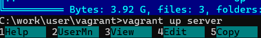{#fig-1 width=70%}

Далее запустим виртуальную машину server (рис. @fig-2):

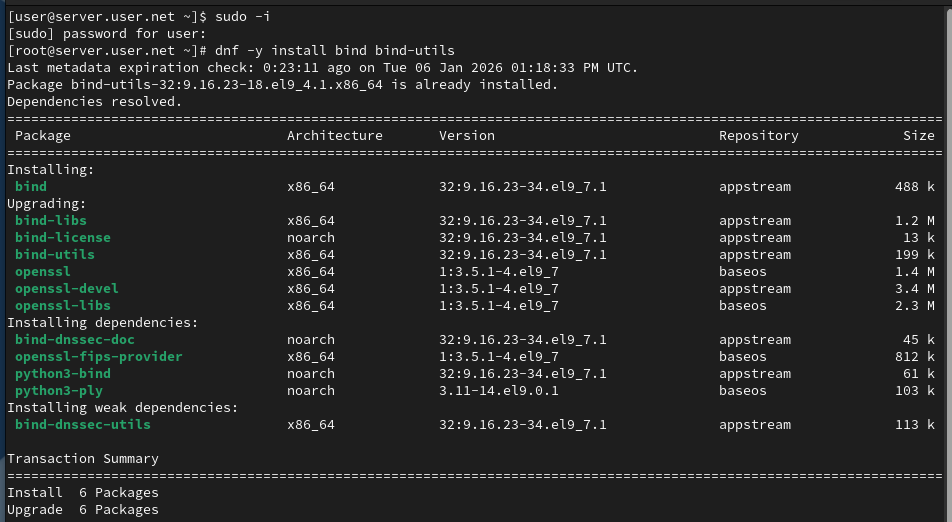{#fig-2 width=70%}

## Установка DNS-сервера

На виртуальной машине server войдём под созданным нами в предыдущей работе пользователем и откроем терминал. Перейдём в режим суперпользователя и установим bind и bind-utils (рис. @fig-3):

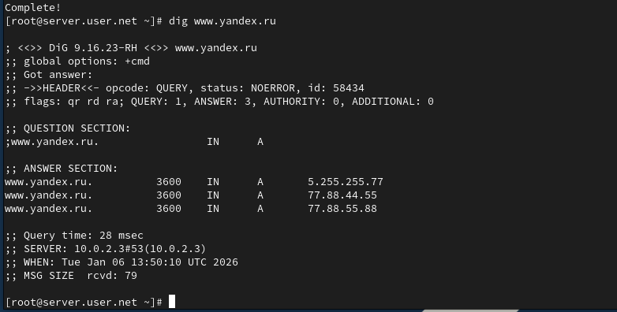{#fig-3 width=70%}

## Проверка работы DNS

С помощью утилиты dig сделаем запрос к DNS-адресу www.yandex.ru (рис. @fig-4):

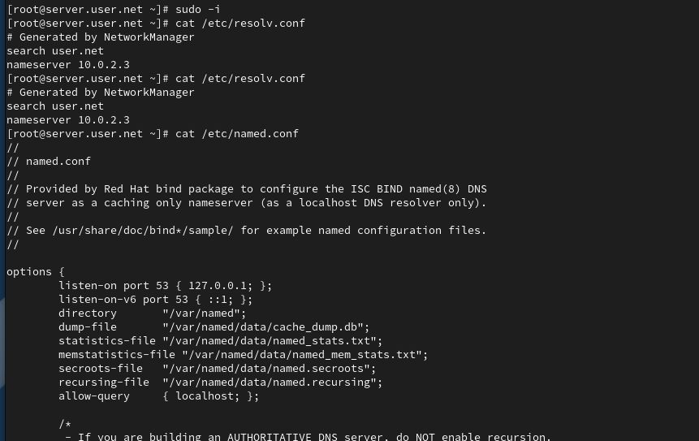{#fig-4 width=70%}

## Просмотр конфигурационных файлов

Просмотрим содержание основных конфигурационных файлов DNS (рис. @fig-5, @fig-6, @fig-7, @fig-8, @fig-9):

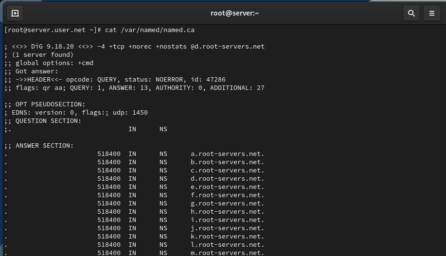{#fig-5 width=70%}

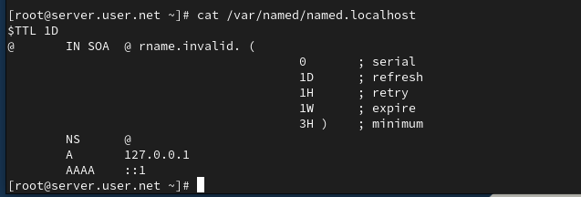{#fig-6 width=70%}

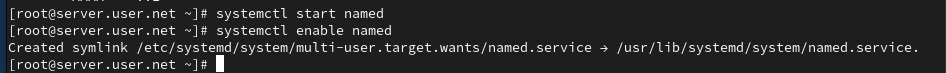{#fig-7 width=70%}

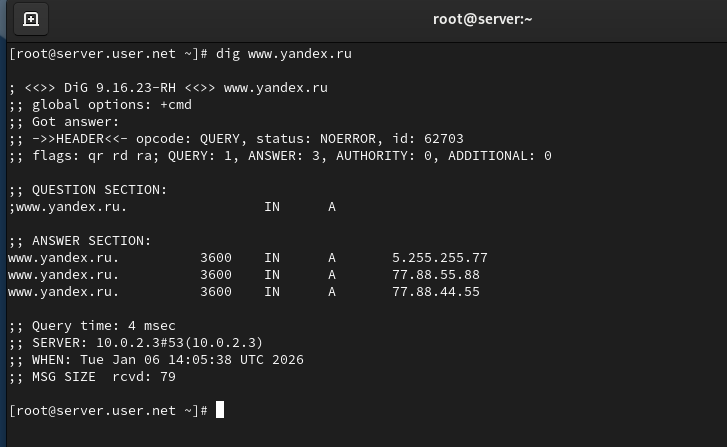{#fig-8 width=70%}

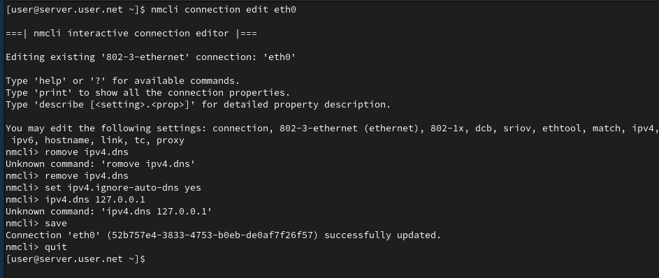{#fig-9 width=70%}

## Запуск DNS-сервера

Запустим DNS-сервер и включим его в автозагрузку (рис. @fig-10):

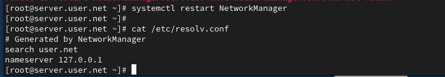{#fig-10 width=70%}

## Анализ работы DNS-сервера

Проанализируем отличие в выведенной на экран информации при выполнении команд (рис. @fig-11):

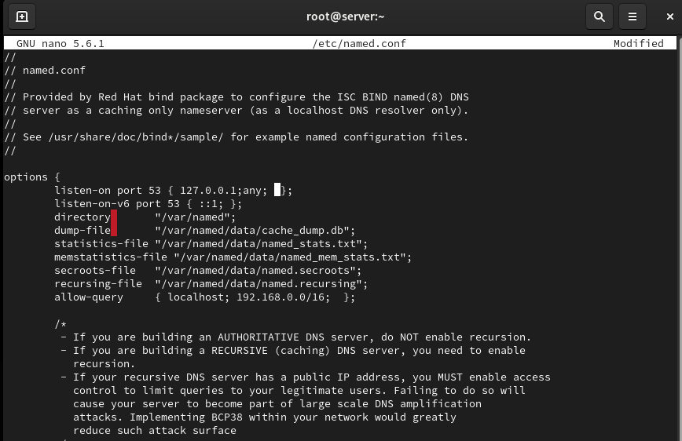{#fig-11 width=70%}

## Настройка сетевых параметров

Сделаем DNS-сервер сервером по умолчанию для хоста server и внутренней виртуальной сети. Для этого изменим настройки сетевого соединения eth0 в NetworkManager (рис. @fig-12):

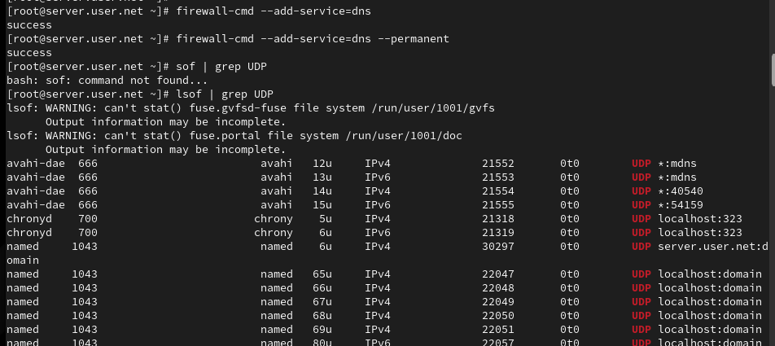{#fig-12 width=70%}

Повторим действия для соединения System eth0 (рис. @fig-13):

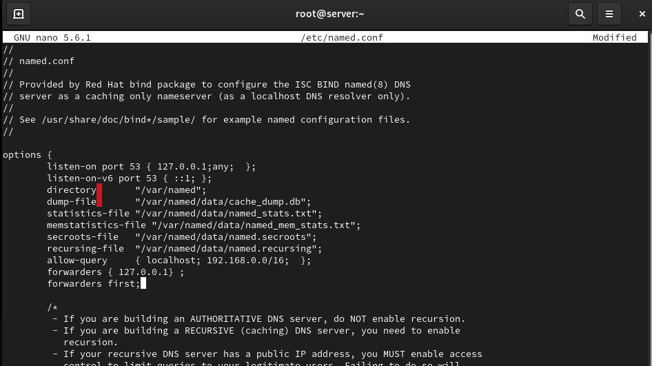{#fig-13 width=70%}

Перезапустим NetworkManager и проверим наличие изменений в файле /etc/resolv.conf (рис. @fig-14):

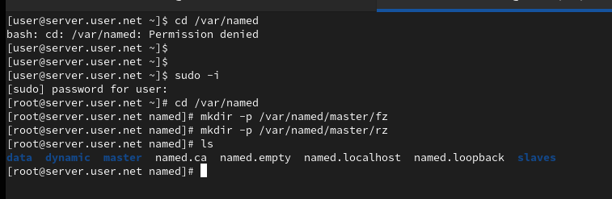{#fig-14 width=70%}

## Настройка конфигурации named

Внесём изменения в файл /etc/named.conf для настройки направления DNS-запросов (рис. @fig-15):

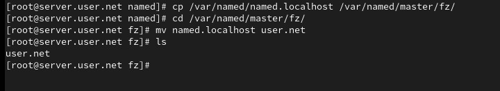{#fig-15 width=70%}

## Настройка межсетевого экрана

Внесём изменения в настройки межсетевого экрана узла server, разрешив работу с DNS (рис. @fig-16):

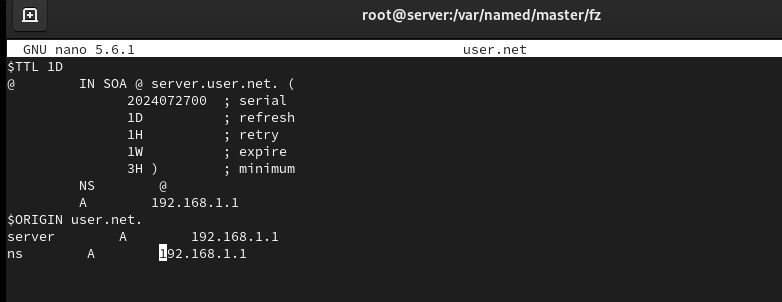{#fig-16 width=70%}

## Настройка перенаправлений

Добавим перенаправление DNS-запросов на вышестоящий DNS-сервер и отключим DNSSEC при необходимости (рис. @fig-17):

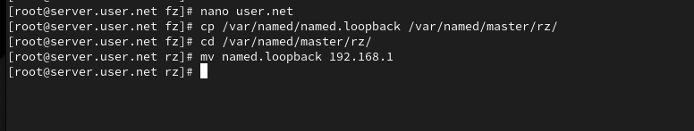{#fig-17 width=70%}

## Создание прямой зоны

Откроем файл /etc/named/user.net и пропишем прямую и обратную зоны (рис. @fig-18):

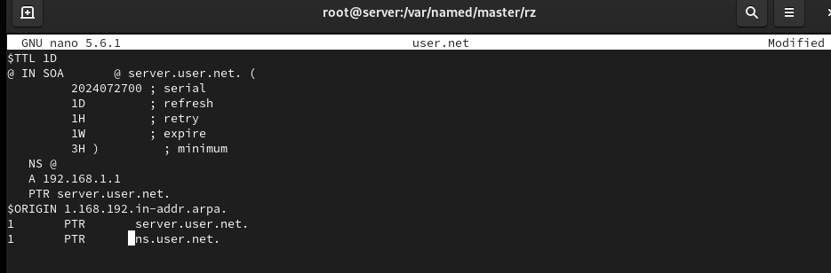{#fig-18 width=70%}

Создадим подкаталоги для файлов зон (рис. @fig-19):

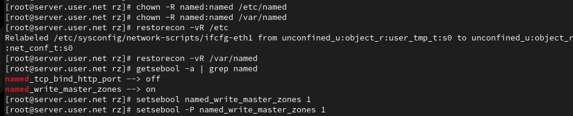{#fig-19 width=70%}

Скопируем шаблон прямой DNS-зоны и переименуем его (рис. @fig-20):

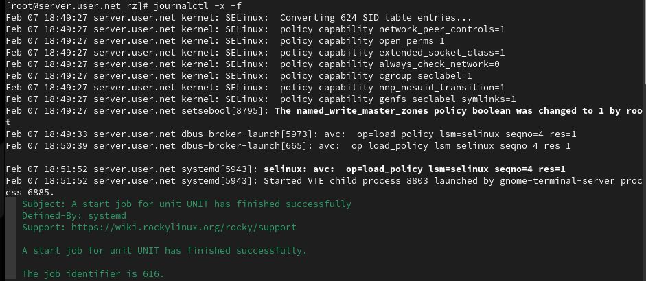{#fig-20 width=70%}

Отредактируем файл прямой зоны (рис. @fig-21):

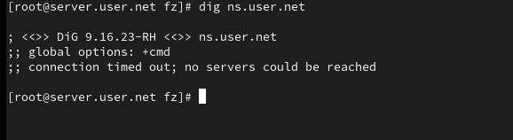{#fig-21 width=70%}

## Создание обратной зоны

Скопируем шаблон обратной DNS-зоны и переименуем его (рис. @fig-22):

{#fig-22 width=70%}

Отредактируем файл обратной зоны (рис. @fig-23):

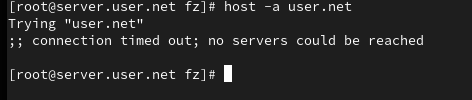{#fig-23 width=70%}

## Настройка прав доступа и SELinux

Исправим права доступа к файлам и восстановим метки SELinux (рис. @fig-24):

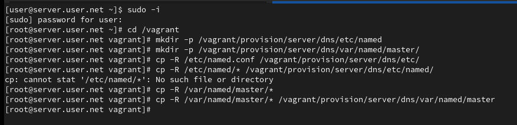{#fig-24 width=70%}

## Проверка работы DNS-сервера

Запустим мониторинг системных сообщений (рис. @fig-25):

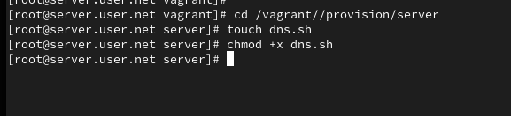{#fig-25 width=70%}

# Выводы

В ходе выполнения лабораторной работы были приобретены практические навыки по установке и конфигурированию DNS-сервера, а также усвоены принципы работы системы доменных имён.

# Контрольные вопросы

1. **Что такое DNS?**  
   Это система, предназначенная для преобразования человекочитаемых доменных имен в IP-адреса, используемые компьютерами для идентификации друг друга в сети.

2. **Каково назначение кэширующего DNS-сервера?**  
   Его задача - хранить результаты предыдущих DNS-запросов в памяти. Когда клиент делает запрос, кэширующий DNS проверяет свой кэш, и если он содержит соответствующую информацию, сервер возвращает ее без необходимости обращаться к другим DNS-серверам. Это ускоряет процесс запроса.

3. **Чем отличается прямая DNS-зона от обратной?**  
   Прямая зона преобразует доменные имена в IP-адреса, обратная зона выполняет обратное: преобразует IP-адреса в доменные имена.

4. **В каких каталогах и файлах располагаются настройки DNS-сервера? Кратко охарактеризуйте, за что они отвечают.**  
   В Linux-системах обычно используется файл /etc/named.conf для общих настроек. Зоны хранятся в файлах в каталоге /var/named/, например, /var/named/example.com.zone.

5. **Что указывается в файле resolv.conf?**  
   Содержит информацию о DNS-серверах, используемых системой, а также о параметрах конфигурации.

6. **Какие типы записи описания ресурсов есть в DNS и для чего они используются?**  
   A (IPv4-адрес), AAAA (IPv6-адрес), CNAME (каноническое имя), MX (почтовый сервер), NS (имя сервера), PTR (обратная запись), SOA (начальная запись зоны), TXT (текстовая информация).

7. **Для чего используется домен in-addr.arpa?**  
   Используется для обратного маппинга IP-адресов в доменные имена.

8. **Для чего нужен демон named?**  
   Это DNS-сервер, реализация BIND (Berkeley Internet Name Domain).

9. **В чём заключаются основные функции slave-сервера и master-сервера?**  
   Master-сервер хранит оригинальные записи зоны, slave-серверы получают копии данных от master-сервера.

10. **Какие параметры отвечают за время обновления зоны?**  
    refresh, retry, expire, и minimum.

11. **Как обеспечить защиту зоны от скачивания и просмотра?**  
    Это может включать в себя использование TSIG (Transaction SIGnatures) для аутентификации между серверами.

12. **Какая запись RR применяется при создании почтовых серверов?**  
    MX (Mail Exchange).

13. **Как протестировать работу сервера доменных имён?**  
    Используйте команды nslookup, dig, или host.

14. **Как запустить, перезапустить или остановить какую-либо службу в системе?**  
    systemctl start|stop|restart <service>.

15. **Как посмотреть отладочную информацию при запуске какого-либо сервиса или службы?**  
    Используйте опции, такие как -d или -v при запуске службы.

16. **Где хранится отладочная информация по работе системы и служб? Как её посмотреть?**  
    В системных журналах, доступных через journalctl.

17. **Как посмотреть, какие файлы использует в своей работе тот или иной процесс? Приведите несколько примеров.**  
    lsof -p <pid> или fuser -v <file>.

18. **Приведите несколько примеров по изменению сетевого соединения при помощи командного интерфейса nmcli.**  
    Примеры включают nmcli connection up|down <connection_name>.

19. **Что такое SELinux?**  
    Это мандатный контроль доступа для ядра Linux.

20. **Что такое контекст (метка) SELinux?**  
    Метка, определяющая, какие ресурсы могут быть доступны процессу или объекту.

21. **Как восстановить контекст SELinux после внесения изменений в конфигурационные файлы?**  
    restorecon -Rv <directory>.

22. **Как создать разрешающие правила политики SELinux из файлов журналов, содержащих сообщения о запрете операций?**  
    Используйте audit2allow.

23. **Что такое булевый переключатель в SELinux?**  
    Это параметр, который включает или отключает определенные аспекты защиты SELinux.

24. **Как посмотреть список переключателей SELinux и их состояние?**  
    getsebool -a.

25. **Как изменить значение переключателя SELinux?**  
    setsebool -P <boolean_name> <on|off>.
