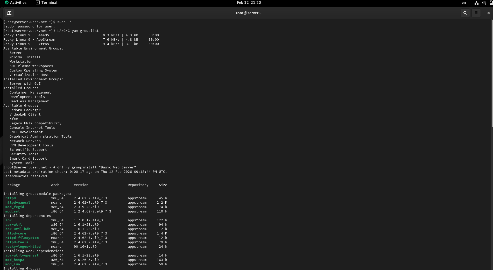
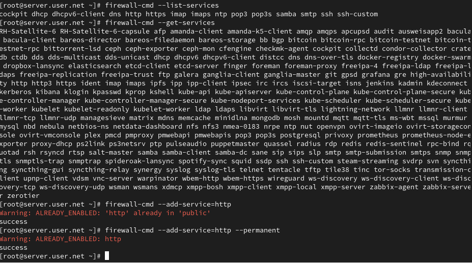
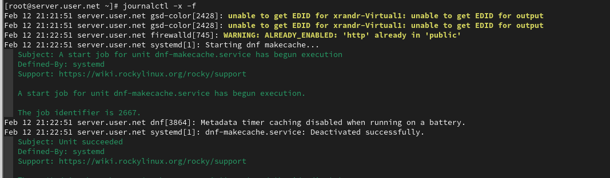
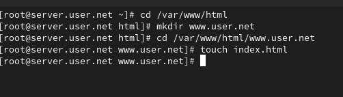
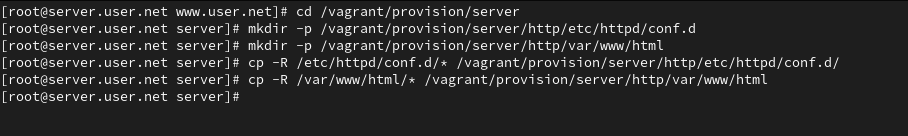

# Цель работы

Целью данной работы является приобретение практических навыков по установке и конфигурированию DHCP-сервера.

# Выполнение лабораторной работы

## Подготовка к работе

Загрузим нашу операционную систему и перейдём в рабочий каталог с проектом. Далее запустим виртуальную машину server (рис. @fig-1):

{#fig-1 width=70%}

## Установка DHCP-сервера

На виртуальной машине server войдём под нашим пользователем и откроем терминал. Перейдём в режим суперпользователя и установим dhcp-server (рис. @fig-2):

{#fig-2 width=70%}

## Настройка конфигурационного файла DHCP

Скопируем файл примера конфигурации DHCP dhcpd.conf.example из каталога /usr/share/doc/dhcp* в каталог /etc/dhcp и переименуем его в файл с названием dhcpd.conf (рис. @fig-3):

{#fig-3 width=70%}

Откроем файл /etc/dhcp/dhcpd.conf на редактирование. В этом файле заменим строки option domain-name и option domain-name-servers, раскомментируем строку authoritative и на базе одного из приведённых в файле примеров конфигурирования подсети зададим собственную конфигурацию dhcp-сети (рис. @fig-4):

{#fig-4 width=70%}

## Настройка службы DHCP

Откроем файл /etc/systemd/system/dhcpd.service на редактирование и заменим в нём строку, указав интерфейс eth1. Затем перезагрузим конфигурацию dhcpd и разрешим загрузку DHCP-сервера при запуске виртуальной машины server (рис. @fig-5):

{#fig-5 width=70%}

## Настройка DNS-записей для DHCP-сервера

Добавим запись для DHCP-сервера в конце файла прямой DNS-зоны /var/named/master/fz/user.net и в конце файла обратной зоны /var/named/master/rz/192.168.1. Перезапустим named и проверим, что можно обратиться к DHCP-серверу по имени (рис. @fig-6):

{#fig-6 width=70%}

## Настройка межсетевого экрана и SELinux

Внесём изменения в настройки межсетевого экрана узла server, разрешив работу с DHCP, и восстановим контекст безопасности в SELinux (рис. @fig-7):

{#fig-7 width=70%}

# Выводы

В ходе выполнения лабораторной работы были приобретены практические навыки по установке и конфигурированию DHCP-сервера.

# Контрольные вопросы

1. **В каких файлах хранятся настройки сетевых подключений?**  
   В наиболее популярных операционных системах, таких как Windows и Linux, настройки сетевых подключений хранятся в различных файлах:
   - В Windows основные настройки сетевых подключений хранятся в реестре. Конфигурационные данные также могут быть сохранены в текстовых файлах.
   - В Linux настройки сети обычно хранятся в текстовых файлах в директории /etc/network/ или /etc/sysconfig/network-scripts/.

2. **За что отвечает протокол DHCP?**  
   Протокол DHCP (Dynamic Host Configuration Protocol) отвечает за автоматическое присвоение сетевых настроек устройствам в сети, таких как IP-адреса, маска подсети, шлюз, DNS-серверы и других параметров.

3. **Поясните принцип работы протокола DHCP. Какими сообщениями обмениваются клиент и сервер, используя протокол DHCP?**  
   Принцип работы протокола DHCP:
   - **Discover (Обнаружение)**: Клиент отправляет в сеть запрос на обнаружение DHCP-сервера.
   - **Offer (Предложение)**: DHCP-сервер отвечает клиенту, предлагая ему конфигурацию сети.
   - **Request (Запрос)**: Клиент принимает предложение и отправляет запрос на использование предложенной конфигурации.
   - **Acknowledgment (Подтверждение)**: DHCP-сервер подтверждает клиенту, что предложенная конфигурация принята и может быть использована.

4. **В каких файлах обычно находятся настройки DHCP-сервера? За что отвечает каждый из файлов?**  
   Настройки DHCP-сервера обычно хранятся в файлах конфигурации, таких как:
   - В Linux: /etc/dhcp/dhcpd.conf
   - В Windows: %SystemRoot%\System32\dhcp\dhcpd.conf
   Они содержат информацию о диапазонах IP-адресов, параметрах сети и других опциях DHCP.

5. **Что такое DDNS? Для чего применяется DDNS?**  
   DDNS (Dynamic Domain Name System) - это система динамического доменного имени. Она используется для автоматического обновления записей DNS, когда IP-адрес узла изменяется. DDNS применяется, например, в домашних сетях, где IP-адреса часто изменяются посредством DHCP.

6. **Какую информацию можно получить, используя утилиту ifconfig? Приведите примеры с использованием различных опций.**  
   Утилита ifconfig используется для получения информации о сетевых интерфейсах.
   Примеры:
   - `ifconfig`: Показывает информацию обо всех активных сетевых интерфейсах.
   - `ifconfig eth0`: Показывает информацию о конкретном интерфейсе (в данном случае, eth0).

7. **Какую информацию можно получить, используя утилиту ping? Приведите примеры с использованием различных опций.**  
   Утилита ping используется для проверки доступности узла в сети.
   Примеры:
   - `ping google.com`: Пингует домен google.com.
   - `ping -c 4 192.168.1.1`: Пингует IP-адрес 192.168.1.1 и отправляет 4 эхо-запроса.
