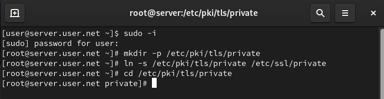
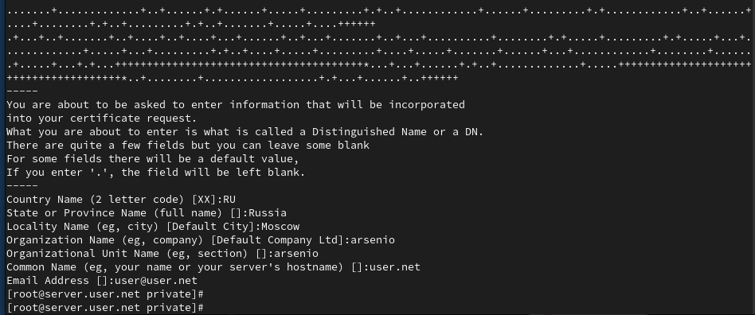
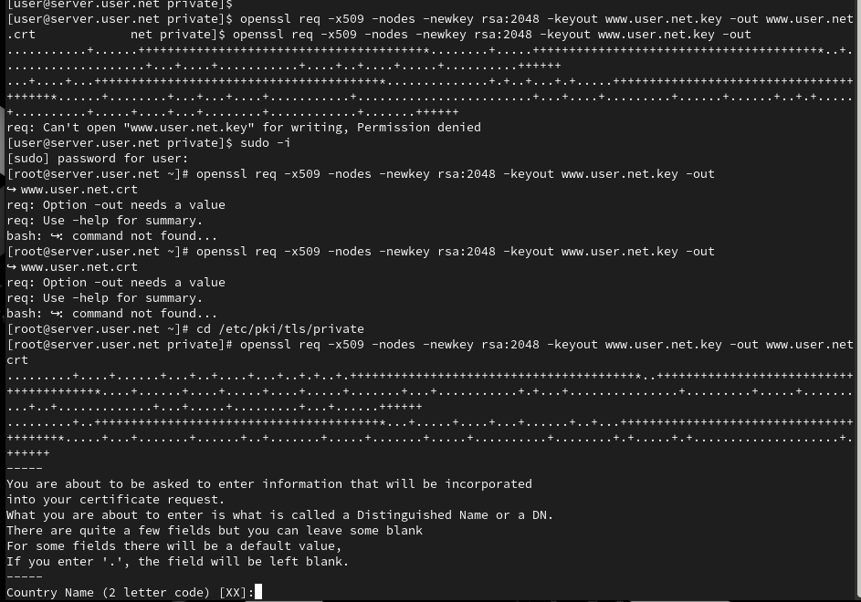
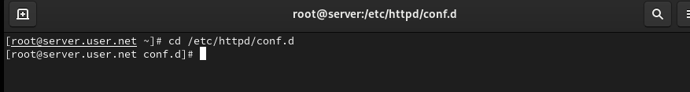
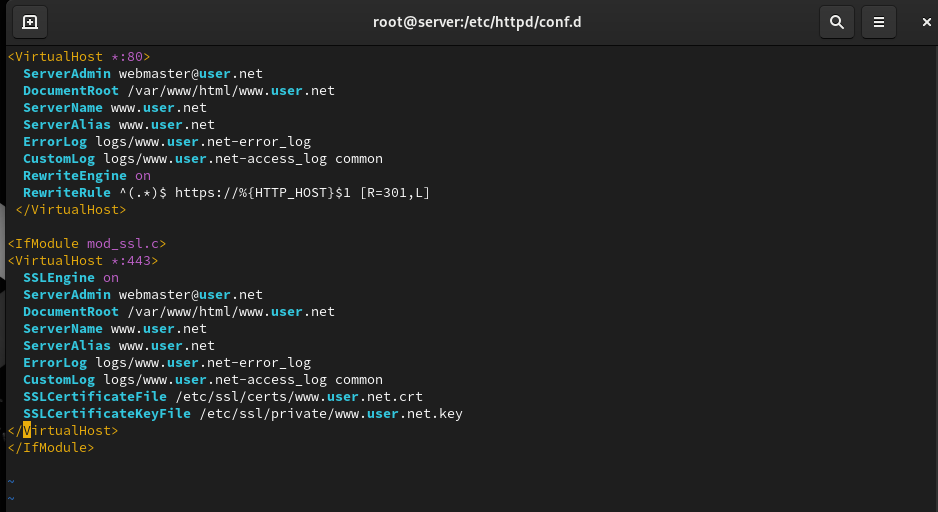
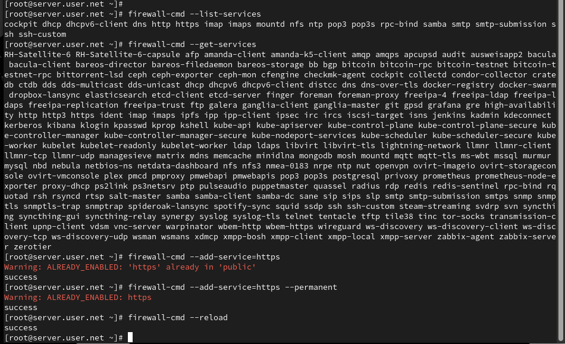
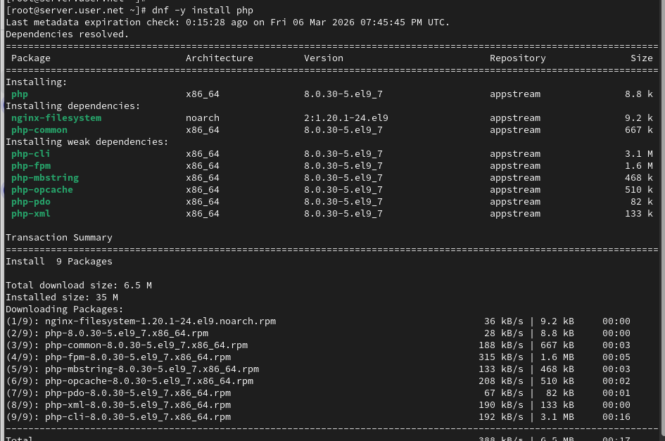
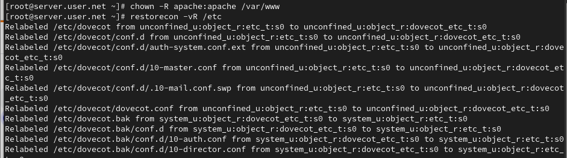
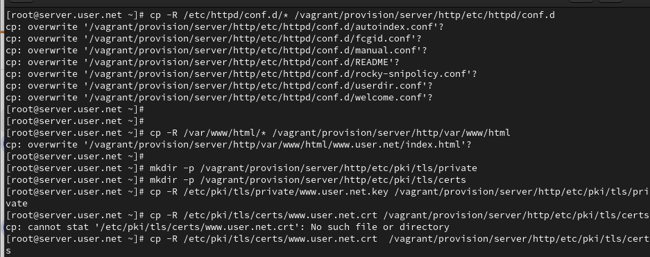

# Цель работы

Целью данной работы является приобретение практических навыков по расширенному конфигурированию HTTP-сервера Apache в части безопасности и возможности использования PHP.

# Выполнение лабораторной работы

## Подготовка к работе

Загрузим нашу операционную систему и перейдём в рабочий каталог с проектом. Далее запустим виртуальную машину server (рис. @fig-1):

{#fig-1 width=70%}

## Создание каталогов для сертификатов

На виртуальной машине server войдём под нашим пользователем и откроем терминал. Далее перейдём в режим суперпользователя. В каталоге /etc/ssl создадим каталог private (рис. @fig-2):

{#fig-2 width=70%}

## Генерация ключа и сертификата

Сгенерируем ключ (рис. @fig-3) и сертификат (рис. @fig-4), используя команду openssl:

{#fig-3 width=70%}

{#fig-4 width=70%}

## Настройка конфигурационного файла веб-сервера

Для перехода веб-сервера www.user.net на функционирование через протокол HTTPS требуется изменить его конфигурационный файл. Для этого перейдём в каталог с конфигурационными файлами (рис. @fig-5):

{#fig-5 width=70%}

Откроем на редактирование файл /etc/httpd/conf.d/www.user.net.conf и заменим его содержимое на то, которое дано в лабораторной работе (рис. @fig-6):

{#fig-6 width=70%}

## Настройка межсетевого экрана

Внесём изменения в настройки межсетевого экрана на сервере, разрешив работу с https, и перезапустим веб-сервер (рис. @fig-7):

{#fig-7 width=70%}

## Проверка работы HTTPS

На виртуальной машине client в строке браузера введём название веб-сервера www.user.net и убедимся, что произошло автоматическое переключение на работу по протоколу HTTPS. На открывшейся странице с сообщением о незащищённости соединения нажмём кнопку «Дополнительно», затем добавим адрес нашего сервера в постоянные исключения (рис. @fig-8):

{#fig-8 width=70%}

## Установка и настройка PHP

Установим пакеты для работы с PHP. В каталоге /var/www/html/www.user.net заменим файл index.html на index.php с соответствующим содержанием (рис. @fig-9):

{#fig-9 width=70%}

Скорректируем права доступа в каталог с веб-контентом, восстановим контекст безопасности в SELinux и перезапустим HTTP-сервер (рис. @fig-10):

{#fig-10 width=70%}

# Выводы

В ходе выполнения лабораторной работы были приобретены практические навыки по расширенному конфигурированию HTTP-сервера Apache в части безопасности и возможности использования PHP.

# Контрольные вопросы

1. **В чём отличие HTTP от HTTPS?**  
   HTTP (HyperText Transfer Protocol) – это протокол передачи данных, который используется для передачи информации между клиентом (например, веб-браузером) и сервером. Однако он не обеспечивает шифрование данных, что делает их уязвимыми к перехвату злоумышленниками.
   
   HTTPS (HyperText Transfer Protocol Secure) - это расширение протокола HTTP с добавлением шифрования, обеспечивающее безопасную передачу данных между клиентом и сервером. Протокол HTTPS использует SSL (Secure Sockets Layer) или более современный TLS (Transport Layer Security) для шифрования данных.

2. **Каким образом обеспечивается безопасность контента веб-сервера при работе через HTTPS?**  
   - **Шифрование данных**: при использовании HTTPS данные, передаваемые между клиентом и сервером, шифруются, что делает их невозможными для прочтения злоумышленниками, перехватывающими трафик.
   - **Идентификация сервера**: сервер предоставляет цифровой сертификат, подтверждающий его легитимность. Этот сертификат выдается сертификационным центром и содержит информацию о владельце сертификата, публичный ключ для шифрования и подпись, подтверждающую подлинность сертификата.

3. **Что такое сертификационный центр? Приведите пример.**  
   Сертификационный центр (Центр сертификации) - это доверенная сторона, которая выдает цифровые сертификаты, подтверждающие подлинность владельца сертификата.
   
   Пример: Одним из известных сертификационных центров является "Let's Encrypt". Он предоставляет бесплатные SSL-сертификаты, которые используются для обеспечения безопасного соединения на множестве веб-сайтов. Владельцы веб-сайтов могут получить сертификат от Let's Encrypt, чтобы обеспечить шифрование и подтвердить свою легитимность в онлайн-среде.
