# Цель работы

Целью данной работы является приобретение практических навыков по установке и конфигурированию системы управления базами данных на примере программного обеспечения MariaDB.

# Выполнение лабораторной работы

## Подготовка к работе

Загрузим нашу операционную систему и перейдём в рабочий каталог с проектом. Далее запустим виртуальную машину server (рис. @fig-1):

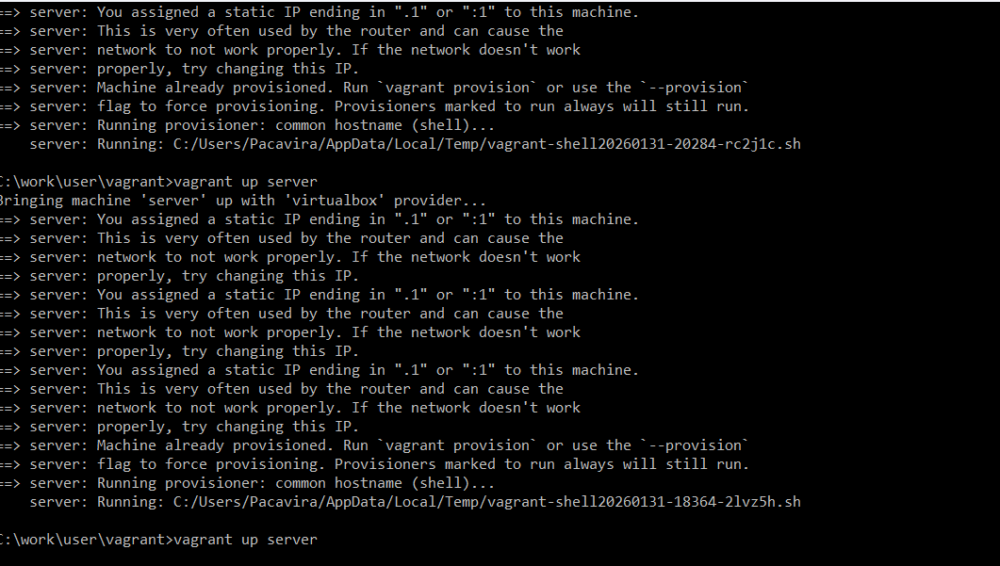{#fig-1 width=70%}

## Установка MariaDB

На виртуальной машине server войдём под нашим пользователем и откроем терминал. Далее перейдём в режим суперпользователя и установим необходимые для работы с базами данных пакеты (рис. @fig-2):

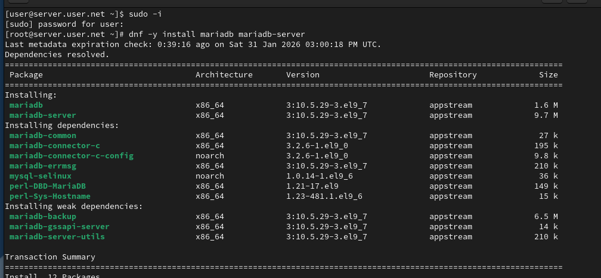{#fig-2 width=70%}

## Просмотр конфигурационных файлов

Просмотрим конфигурационные файлы mariadb в каталоге /etc/my.cnf.d и в файле /etc/my.cnf (рис. @fig-3):

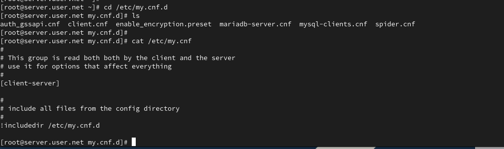{#fig-3 width=70%}

## Запуск и настройка безопасности

Для запуска и включения программного обеспечения mariadb используем соответствующие команды. Убедимся, что mariadb прослушивает порт, и запустим скрипт конфигурации безопасности mariadb (рис. @fig-4):

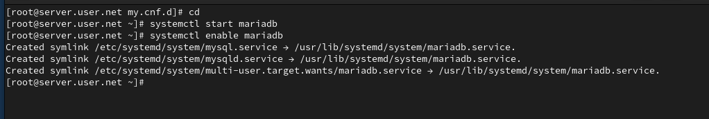{#fig-4 width=70%}

## Вход в базу данных

Для входа в базу данных с правами администратора базы данных введём соответствующую команду. После чего просмотрим список команд MySQL (рис. @fig-5):

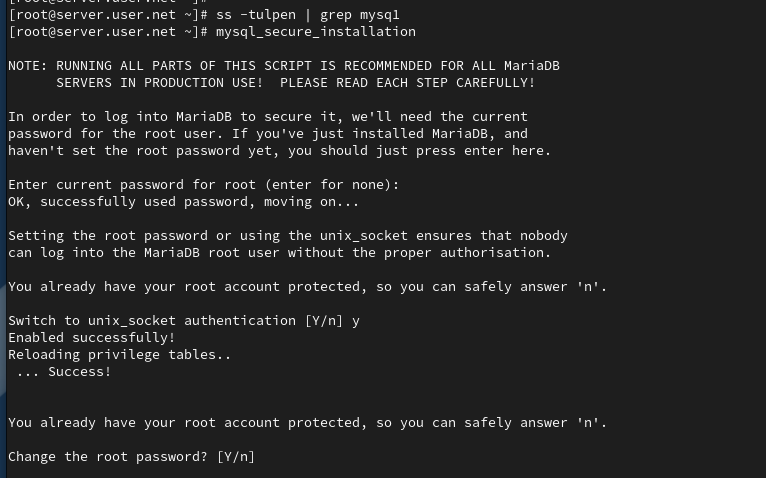{#fig-5 width=70%}

## Просмотр баз данных

Из приглашения интерактивной оболочки MariaDB для отображения доступных в настоящее время баз данных введём MySQL-запрос. Для выхода из интерфейса интерактивной оболочки MariaDB используем соответствующую команду (рис. @fig-6):

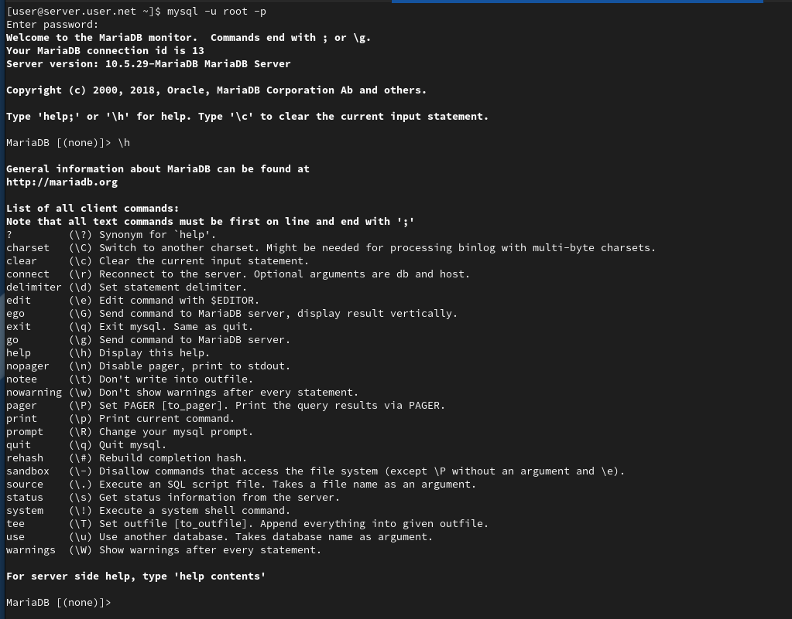{#fig-6 width=70%}

## Просмотр статуса MariaDB

Войдём в базу данных с правами администратора. Для отображения статуса MariaDB введём из приглашения интерактивной оболочки соответствующую команду (рис. @fig-7):

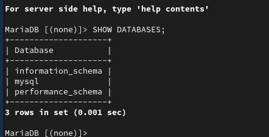{#fig-7 width=70%}

## Настройка кодировки UTF-8

В каталоге /etc/my.cnf.d создадим файл utf8.cnf. Откроем его на редактирование и укажем в нём конфигурацию для поддержки UTF-8 (рис. @fig-8):

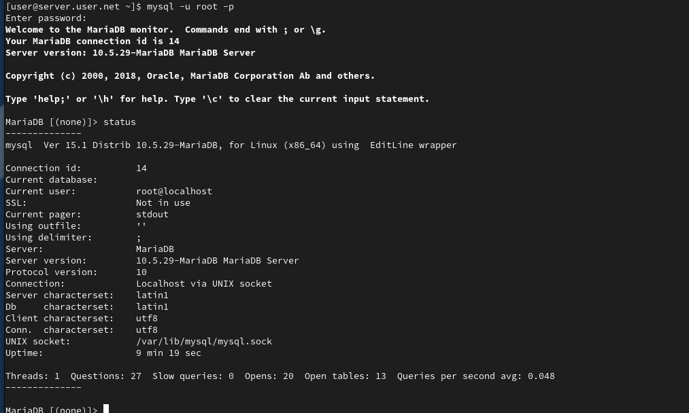{#fig-8 width=70%}

## Перезапуск MariaDB

Перезапустим MariaDB для применения изменений (рис. @fig-9):

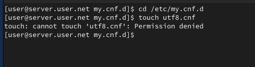{#fig-9 width=70%}

## Проверка изменений

Войдём повторно в базу данных с правами администратора и посмотрим статус MariaDB для проверки изменений (рис. @fig-10):

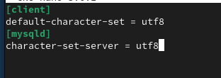{#fig-10 width=70%}

## Создание базы данных и таблицы

Войдём в базу данных с правами администратора. Создадим базу данных с именем addressbook. Теперь перейдём к базе данных addressbook. Отобразим имеющиеся в базе данных addressbook таблицы. Создадим таблицу city с полями name и city. Заполним несколько строк таблицы некоторыми данными (рис. @fig-11):

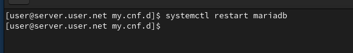{#fig-11 width=70%}

## Работа с данными и пользователями

Сделаем MySQL-запрос для просмотра данных. Теперь создадим пользователя для работы с базой данных addressbook и зададим для него пароль. Предоставим права доступа созданному пользователю на действия с базой данных addressbook. Обновим привилегии базы данных addressbook. Просмотрим общую информацию о таблице city. Выйдем из окружения MariaDB (рис. @fig-12):

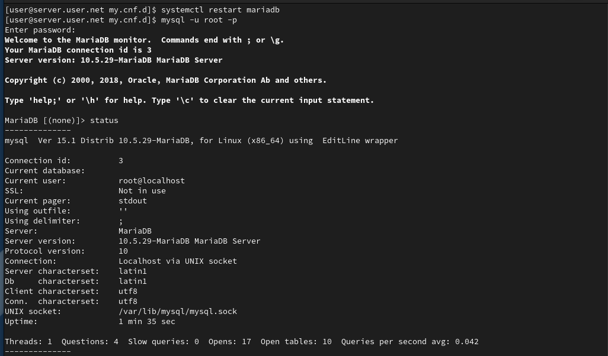{#fig-12 width=70%}

## Просмотр баз данных и таблиц

Просмотрим список баз данных. Отдельно просмотрим список таблиц базы данных addressbook (рис. @fig-13):

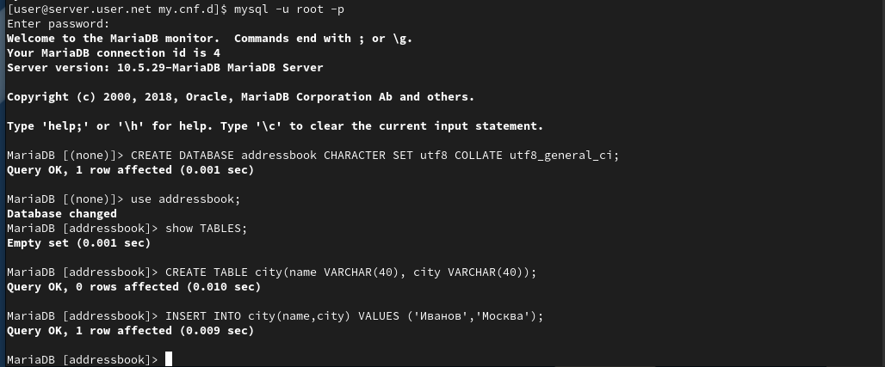{#fig-13 width=70%}

## Создание резервных копий

На виртуальной машине server создадим каталог для резервных копий. Сделаем резервную копию базы данных addressbook. Сделаем сжатую резервную копию базы данных addressbook. Сделаем сжатую резервную копию базы данных addressbook с указанием даты создания копии. Восстановим базу данных addressbook из резервной копии. Восстановим базу данных addressbook из сжатой резервной копии (рис. @fig-14):

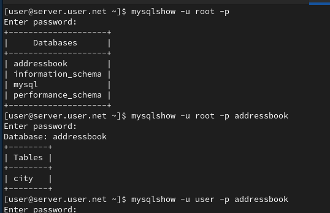{#fig-14 width=70%}

## Настройка автоматического развёртывания

На виртуальной машине server перейдём в каталог для внесения изменений в настройки внутреннего окружения, создадим в нём каталог mysql, в который поместим в соответствующие подкаталоги конфигурационные файлы MariaDB и резервную копию базы данных addressbook. В каталоге создадим исполняемый файл mysql.sh. Откроем его на редактирование и пропишем скрипт. Для отработки созданного скрипта во время загрузки виртуальных машин в конфигурационном файле Vagrantfile добавим соответствующую запись (рис. @fig-15):

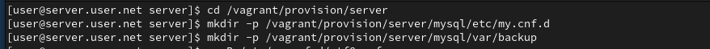{#fig-15 width=70%}

# Выводы

В ходе выполнения лабораторной работы были приобретены практические навыки по установке и конфигурированию системы управления базами данных на примере программного обеспечения MariaDB.

# Контрольные вопросы

1. **Какая команда отвечает за настройки безопасности в MariaDB?**  
   Настройки безопасности в MariaDB обычно управляются с помощью команды `mysql_secure_installation`. Эта команда выполняет несколько шагов, включая установку пароля для пользователя root, удаление анонимных учетных записей, отключение удаленного входа для пользователя root и удаление тестовых баз данных.

2. **Как настроить MariaDB для доступа через сеть?**  
   Для настройки MariaDB для доступа через сеть, вы можете отредактировать файл конфигурации MariaDB (обычно называемый my.cnf) и убедиться, что параметр bind-address установлен на IP-адрес, доступный в вашей сети. Также, убедитесь, что пользователь имеет права доступа извне, например, с использованием команды GRANT.

3. **Какая команда позволяет получить обзор доступных баз данных после входа в среду оболочки MariaDB?**  
   Обзор доступных баз данных после входа в среду оболочки MariaDB можно получить с помощью команды `SHOW DATABASES;`.

4. **Какая команда позволяет узнать, какие таблицы доступны в базе данных?**  
   Для просмотра доступных таблиц в базе данных используйте команду `SHOW TABLES;`.

5. **Какая команда позволяет узнать, какие поля доступны в таблице?**  
   Чтобы узнать, какие поля доступны в таблице, используйте команду `DESCRIBE table_name;` или `SHOW COLUMNS FROM table_name;`.

6. **Какая команда позволяет узнать, какие записи доступны в таблице?**  
   Для просмотра записей в таблице можно использовать команду `SELECT * FROM table_name;`.

7. **Как удалить запись из таблицы?**  
   Для удаления записи из таблицы используйте команду `DELETE FROM table_name WHERE condition;`, где condition - условие, определяющее, какие записи следует удалить.

8. **Где расположены файлы конфигурации MariaDB? Что можно настроить с их помощью?**  
   Файлы конфигурации MariaDB обычно располагаются в различных местах в зависимости от системы, но основной файл - my.cnf. Он может быть в /etc/my.cnf, /etc/mysql/my.cnf или /usr/etc/my.cnf. С помощью этих файлов можно настроить различные параметры, такие как порт, пути к файлам данных, параметры безопасности и другие.

9. **Где располагаются файлы с базами данных MariaDB?**  
   Файлы с базами данных MariaDB располагаются в директории данных. Обычно это /var/lib/mysql/ на Linux-системах.

10. **Как сделать резервную копию базы данных и затем её восстановить?**  
    Для создания резервной копии базы данных используйте команду `mysqldump`. Например, `mysqldump -u username -p dbname > backup.sql`. Для восстановления базы данных из резервной копии используйте команду `mysql -u username -p dbname < backup.sql`.
