# Цель работы

Целью данной работы является получение навыков настройки межсетевого экрана в Linux в части переадресации портов и настройки Masquerading.

# Выполнение лабораторной работы

## Создание пользовательской службы FirewallD

На основе существующего файла описания службы ssh создадим файл с собственным описанием. Перейдём в каталог служб и посмотрим содержимое созданного файла (рис. @fig-1):

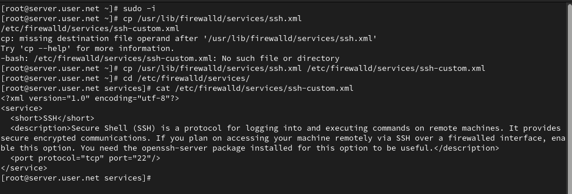{#fig-1 width=70%}

## Редактирование файла службы

Откроем файл описания службы на редактирование и заменим порт 22 на новый порт (2022). В этом же файле скорректируем описание службы для демонстрации, что это модифицированный файл службы (рис. @fig-2):

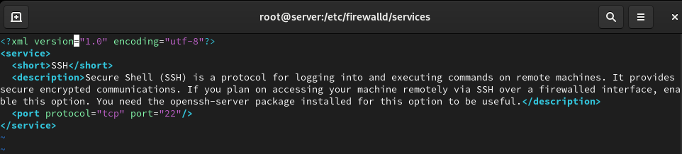{#fig-2 width=70%}

## Просмотр доступных служб

Просмотрим список доступных FirewallD служб, чтобы убедиться, что наша новая служба ещё не отображается (рис. @fig-3):

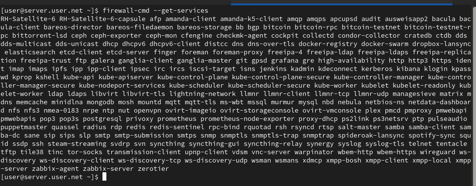{#fig-3 width=70%}

## Перезагрузка правил и проверка

Перегрузим правила межсетевого экрана с сохранением информации о состоянии и вновь выведем на экран список служб, а также список активных служб. Убедимся, что созданная нами служба отображается в списке доступных для FirewallD служб, но не активирована (рис. @fig-4):

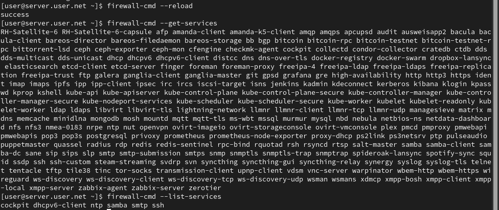{#fig-4 width=70%}

## Активация новой службы

Добавим новую службу в FirewallD и выведем на экран список активных служб, чтобы убедиться в её активации (рис. @fig-5):

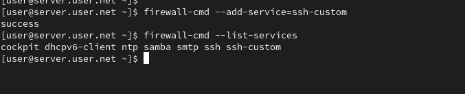{#fig-5 width=70%}

## Настройка переадресации портов

Организуем на сервере переадресацию с порта 2022 на порт 22 (рис. @fig-6):

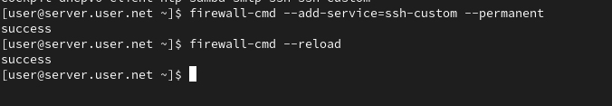{#fig-6 width=70%}

## Проверка доступа через новый порт

На клиенте попробуем получить доступ по SSH к серверу через порт 2022 (рис. @fig-7):

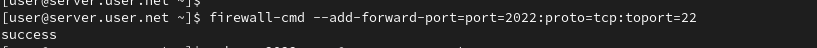{#fig-7 width=70%}

## Проверка перенаправления IPv4-пакетов

На сервере посмотрим, активирована ли в ядре системы возможность перенаправления IPv4-пакетов (рис. @fig-8):

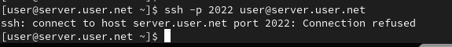{#fig-8 width=70%}

## Включение перенаправления и маскарадинга

Включим перенаправление IPv4-пакетов на сервере и затем включим маскарадинг (рис. @fig-9):

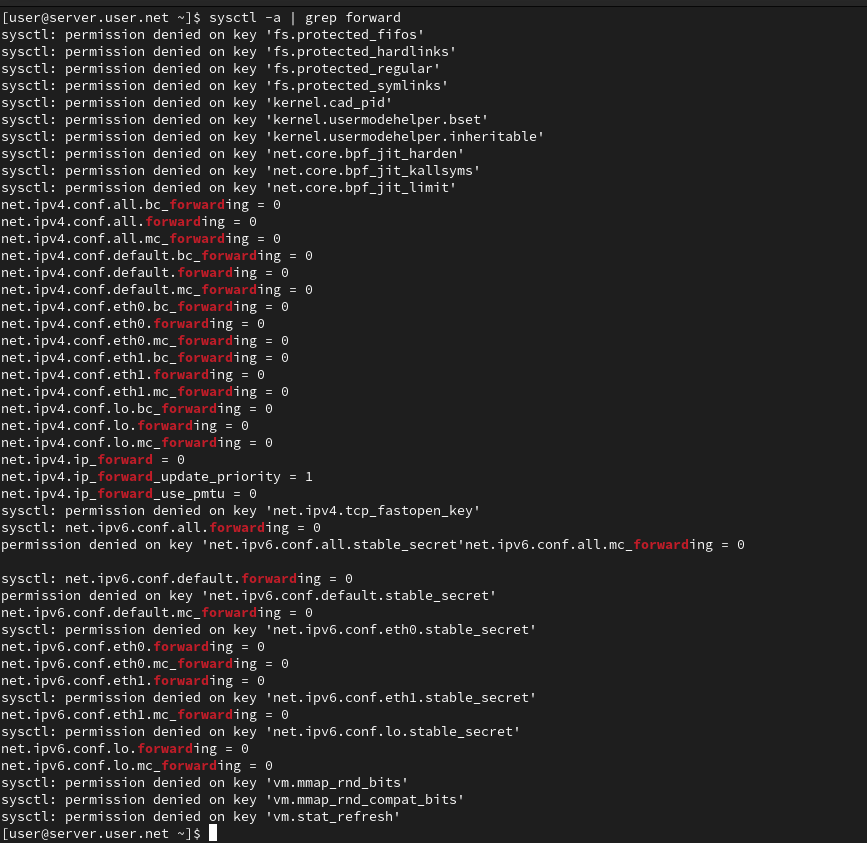{#fig-9 width=70%}

## Проверка выхода в Интернет

На клиенте проверим доступность выхода в Интернет после настройки маскарадинга (рис. @fig-10):

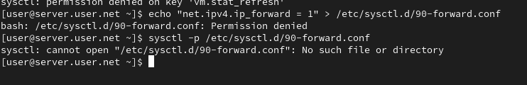{#fig-10 width=70%}

## Настройка автоматического развёртывания

На виртуальной машине server перейдём в каталог для внесения изменений в настройки внутреннего окружения, создадим в нём каталог firewall, в который поместим в соответствующие подкаталоги конфигурационные файлы FirewallD. В каталоге создадим файл firewall.sh (рис. @fig-11):

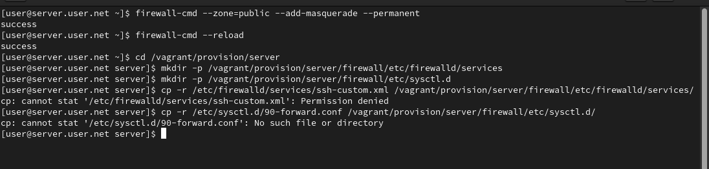{#fig-11 width=70%}

## Создание скрипта и настройка Vagrantfile

Откроем файл firewall.sh на редактирование и пропишем в нём скрипт из лабораторной работы. Для отработки созданного скрипта во время загрузки виртуальной машины server в конфигурационном файле Vagrantfile добавим соответствующую запись (рис. @fig-12):

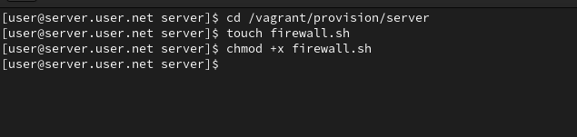{#fig-12 width=70%}

# Выводы

В ходе выполнения лабораторной работы были получены навыки настройки межсетевого экрана в Linux в части переадресации портов и настройки Masquerading.

# Контрольные вопросы

1. **Где хранятся пользовательские файлы firewalld?**  
   В firewalld пользовательские файлы хранятся в директории `/etc/firewalld/`.

2. **Какую строку надо включить в пользовательский файл службы, чтобы указать порт TCP 2022?**  
   Для указания порта TCP 2022 в пользовательском файле службы, вы можете добавить строку в секцию port следующим образом:
   `<port protocol="tcp" port="2022"/>`

3. **Какая команда позволяет вам перечислить все службы, доступные в настоящее время на вашем сервере?**  
   Чтобы перечислить все службы, доступные в настоящее время на сервере с использованием firewalld, используйте команду:
   `firewall-cmd --get-services`

4. **В чем разница между трансляцией сетевых адресов (NAT) и маскарадингом (masquerading)?**  
   Разница между трансляцией сетевых адресов (NAT) и маскарадингом (masquerading) заключается в том, что в случае NAT исходный IP-адрес пакета заменяется на IP-адрес маршрутизатора, а в случае маскарадинга используется IP-адрес интерфейса маршрутизатора.

5. **Какая команда разрешает входящий трафик на порт 4404 и перенаправляет его в службу ssh по IP-адресу 10.0.0.10?**  
   Для разрешения входящего трафика на порт 4404 и перенаправления его на службу SSH по IP-адресу 10.0.0.10, вы можете использовать команды:
