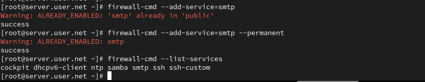
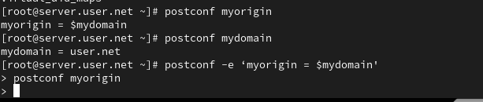
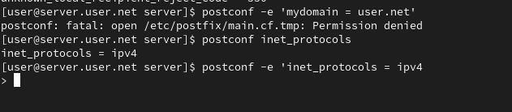
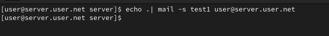
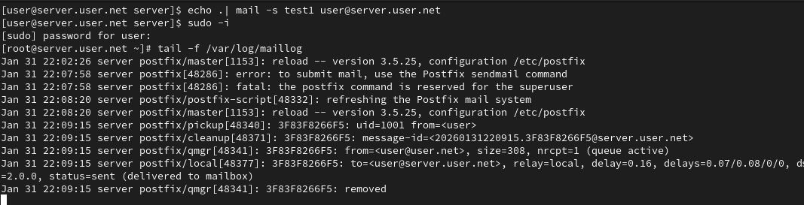
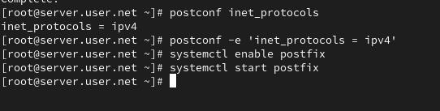
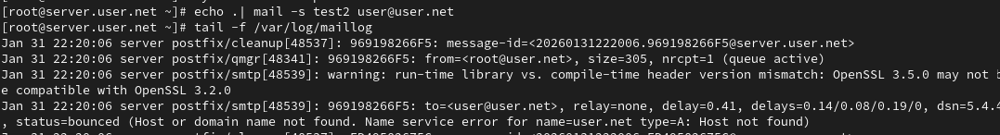
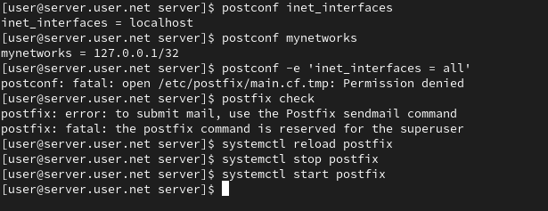

# Цель работы

Целью данной работы является приобретение практических навыков по установке и конфигурированию SMTP-сервера.

# Выполнение лабораторной работы

## Установка Postfix на сервере

На виртуальной машине server войдём под нашим пользователем и откроем терминал. Перейдём в режим суперпользователя и установим необходимые для работы пакеты (рис. @fig-1, @fig-2):

{#fig-1 width=70%}

{#fig-2 width=70%}

## Настройка межсетевого экрана и запуск Postfix

Сконфигурируем межсетевой экран, разрешив работать службе протокола SMTP. Восстановим контекст безопасности в SELinux и запустим Postfix (рис. @fig-3):

{#fig-3 width=70%}

## Настройка параметров Postfix

Просмотрим и изменим параметры Postfix, заменив значение параметра myorigin на значение параметра mydomain (рис. @fig-4):

{#fig-4 width=70%}

## Проверка конфигурации

Проверим корректность конфигурационного файла и перезагрузим Postfix (рис. @fig-5):

{#fig-5 width=70%}

## Отправка тестового письма с сервера

На сервере под учётной записью пользователя отправим себе письмо, используя утилиту mail (рис. @fig-6):

{#fig-6 width=70%}

## Мониторинг почтовой службы

Запустим мониторинг работы почтовой службы и посмотрим, что произошло с нашим сообщением (рис. @fig-7):

{#fig-7 width=70%}

## Установка Postfix на клиенте

На виртуальной машине client установим необходимые для работы пакеты (рис. @fig-8, @fig-9):

{#fig-8 width=70%}

{#fig-9 width=70%}

## Настройка Postfix на клиенте

Настроим Postfix на клиенте и отправим тестовое письмо (рис. @fig-10):

{#fig-10 width=70%}

## Настройка сетевых параметров Postfix на сервере

На сервере настроим параметры сетевых интерфейсов и перезапустим Postfix (рис. @fig-11):

{#fig-11 width=70%}

## Отправка на доменный адрес

С клиента отправим письмо на свой доменный адрес и просмотрим очередь сообщений (рис. @fig-12):

{#fig-12 width=70%}

## Настройка DNS-записей для почты

Пропишем MX-запись в файлах прямой и обратной DNS-зон (рис. @fig-13):

{#fig-13 width=70%}

## Восстановление SELinux и перезапуск DNS

Восстановим контекст безопасности, перезапустим DNS и отправим сообщения из очереди (рис. @fig-14):

{#fig-14 width=70%}

## Настройка автоматического развёртывания

Настроим скрипты для автоматического развёртывания и добавим записи в Vagrantfile (рис. @fig-15):

{#fig-15 width=70%}

# Выводы

В ходе выполнения лабораторной работы были получены навыки по установке и конфигурированию SMTP-сервера.

# Контрольные вопросы

1. **В каком каталоге и в каком файле следует смотреть конфигурацию Postfix?**  
   Конфигурация Postfix обычно хранится в файле main.cf, в каталоге /etc/postfix/. Таким образом, путь к файлу конфигурации будет /etc/postfix/main.cf.

2. **Каким образом можно проверить корректность синтаксиса в конфигурационном файле Postfix?**  
   Для проверки корректности синтаксиса в конфигурационном файле Postfix можно использовать команду `postfix check`.

3. **В каких параметрах конфигурации Postfix требуется внести изменения для настройки возможности отправки писем на доменные адреса?**  
   Для настройки отправки писем на доменные адреса, нужно изменить параметры myhostname и mydomain в файле main.cf:
