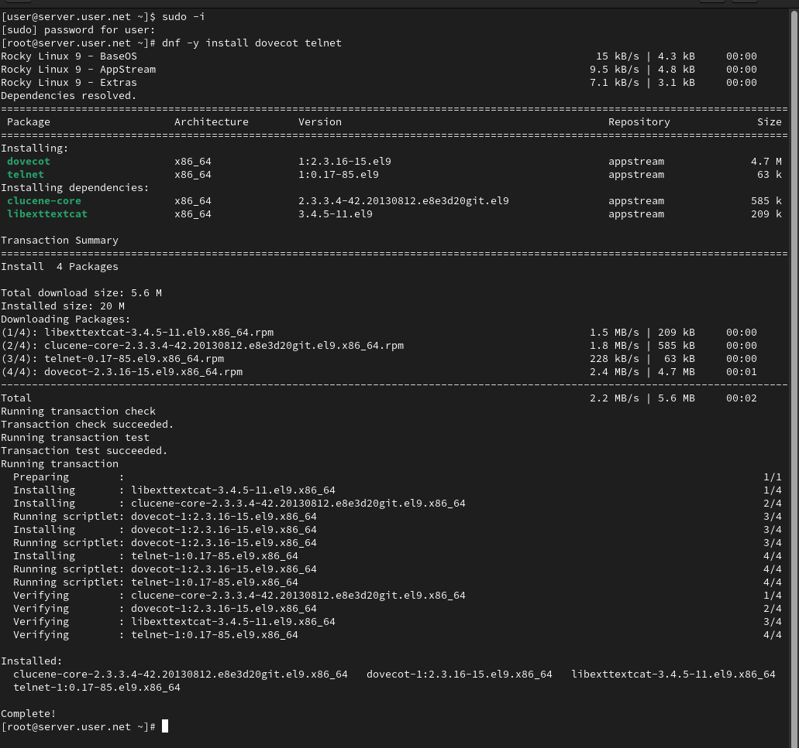
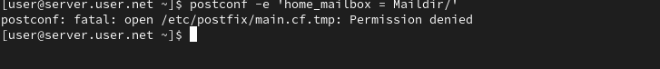
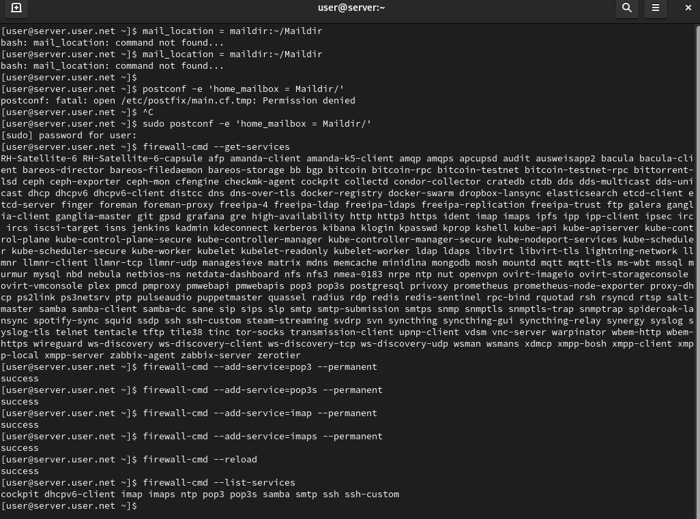
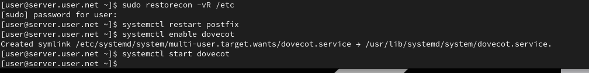
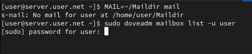
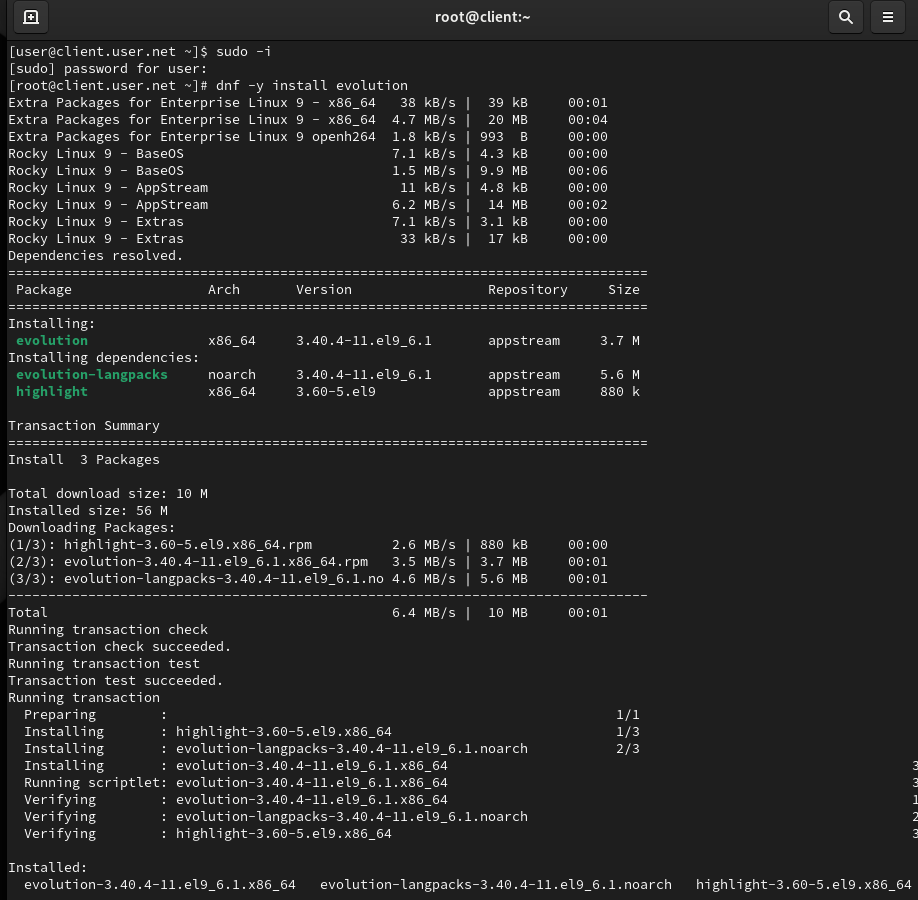
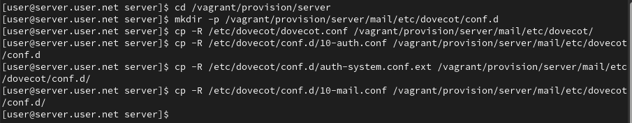
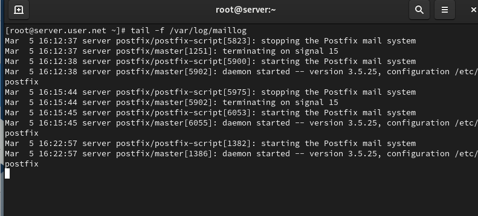

# Цель работы

Целью данной работы является приобретение практических навыков по установке и простейшему конфигурированию POP3/IMAP-сервера.

# Выполнение лабораторной работы

## Установка Dovecot на сервере

На виртуальной машине server войдём под нашим пользователем и откроем терминал. Перейдём в режим суперпользователя и установим необходимые для работы пакеты (рис. @fig-1):

{#fig-1 width=70%}

## Настройка Postfix и межсетевого экрана

В Postfix зададим каталог для доставки почты. Сконфигурируем межсетевой экран, разрешив работать службам протоколов POP3 и IMAP (рис. @fig-2):

{#fig-2 width=70%}

## Восстановление SELinux и запуск служб

Восстановим контекст безопасности в SELinux. Перезапустим Postfix и запустим Dovecot (рис. @fig-3):

{#fig-3 width=70%}

## Просмотр почты на сервере

На терминале сервера просмотрим имеющуюся почту и mailbox пользователя (рис. @fig-4):

{#fig-4 width=70%}

## Настройка почтового клиента на клиенте

На виртуальной машине client установим почтовый клиент Evolution, запустим и настроим его для работы с нашим почтовым сервером (рис. @fig-5):

{#fig-5 width=70%}

## Отправка тестовых писем

Из почтового клиента отправим себе несколько тестовых писем и убедимся, что они доставлены. Параллельно посмотрим сообщения при мониторинге почтовой службы на сервере (рис. @fig-6):

{#fig-6 width=70%}

## Проверка работы через Telnet

Проверим работу почтовой службы, используя на сервере протокол Telnet: подключимся к почтовому серверу по протоколу POP3, получим список писем, прочитаем первое письмо и удалим второе (рис. @fig-7):

{#fig-7 width=70%}

## Настройка автоматического развёртывания

На виртуальной машине server перейдём в каталог для внесения изменений в настройки внутреннего окружения, поместим конфигурационные файлы Dovecot и заменим конфигурационный файл Postfix. Внесём изменения в файл mail.sh на сервере и клиенте (рис. @fig-8):

{#fig-8 width=70%}

# Выводы

В ходе выполнения лабораторной работы были приобретены практические навыки по установке и простейшему конфигурированию POP3/IMAP-сервера.

# Контрольные вопросы

1. **За что отвечает протокол SMTP?**  
   Отвечает за отправку электронной почты. Этот протокол используется для передачи писем от отправителя к почтовому серверу и от сервера к серверу.

2. **За что отвечает протокол IMAP?**  
   Отвечает за доступ и управление электронной почтой на сервере. Позволяет клиентским приложениям просматривать, синхронизировать и управлять сообщениями, хранящимися на почтовом сервере.

3. **За что отвечает протокол POP3?**  
   Отвечает за получение электронной почты. Письма загружаются с почтового сервера на клиентский компьютер, и после этого они обычно удаляются с сервера (но это можно настроить).

4. **В чём назначение Dovecot?**  
   Это почтовый сервер, который предоставляет поддержку протоколов IMAP и POP3. Dovecot обеспечивает доступ к электронной почте на сервере, а также хранение и управление сообщениями.

5. **В каких файлах обычно находятся настройки работы Dovecot? За что отвечает каждый из файлов?**  
   - `/etc/dovecot/dovecot.conf`: Основной файл конфигурации Dovecot.
   - `/etc/dovecot/conf.d/`: Дополнительные файлы конфигурации, разделенные на отдельные модули.

6. **В чём назначение Postfix?**  
   Это почтовый сервер (MTA - Mail Transfer Agent), отвечающий за отправку и маршрутизацию электронной почты.

7. **Какие методы аутентификации пользователей можно использовать в Dovecot и в чём их отличие?**  
   - **PLAIN**: Передача учетных данных в открытом виде (не рекомендуется, если соединение не защищено).
   - **LOGIN**: Аутентификация по протоколу LOGIN, который шифрует только пароль.

8. **Приведите пример заголовка письма с пояснениями его полей.**  
