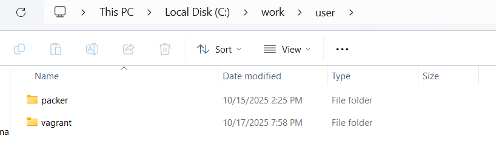
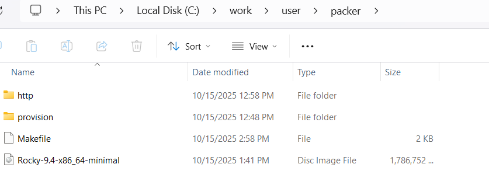
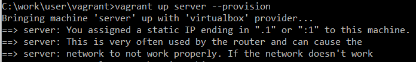
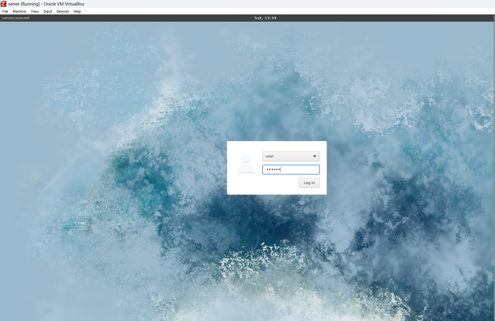
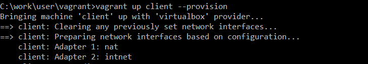

# Цель работы

Целью данной работы является приобретение практических навыков установки Rocky Linux на виртуальную машину с помощью инструмента Vagrant.

# Выполнение лабораторной работы

Перед началом работы с Vagrant создадим каталог для проекта `C:\work\user\packer` и `C:\work\user\vagrant` (рис. @fig-1).

{#fig-1 width=70%}

В созданном рабочем каталоге разместим образ операционной системы Rocky Linux. В этом практикуме используется образ `Rocky-9.2-x86_64minimal.iso`. В этом же каталоге разместим подготовленные заранее для работы с Vagrant файлы и создадим каталог `provision` с подкаталогами `default`, `server` и `client`, в которых будут размещаться скрипты, изменяющие настройки внутреннего окружения базового образа виртуальной машины, сервера или клиента соответственно (рис. @fig-2).

{#fig-2 width=70%}

Для отработки созданных скриптов во время загрузки виртуальных машин убедимся, что в конфигурационном файле `Vagrantfile` до строк с конфигурацией сервера имеется определённая запись (рис. @fig-3).

{#fig-3 width=70%}

Зафиксируем внесённые изменения для внутренних настроек виртуальных машин, введя в терминале команды `make server-provision` (рис. @fig-4) и затем `make client-provision` (рис. @fig-5).

{#fig-4 width=70%}

{#fig-5 width=70%}

Залогинимся на сервере (рис. @fig-6) и клиенте (рис. @fig-7) под созданным пользователем `user`.

{#fig-6 width=70%}

{#fig-7 width=70%}

Убедимся, что в терминале приглашение отображается в виде `user@server.user.net` на сервере и `user@client.user.net` на клиенте (рис. @fig-8).

{#fig-8 width=70%}

# Выводы

В ходе выполнения лабораторной работы были приобретены практические навыки установки Rocky Linux на виртуальную машину с помощью инструмента Vagrant.

# Контрольные вопросы

1. **Для чего предназначен Vagrant?**  
   Это инструмент для создания и управления средами виртуальных машин в одном рабочем процессе. Он позволяет автоматизировать процесс установки на виртуальную машину как основного дистрибутива операционной системы, так и настройки необходимого в дальнейшем программного обеспечения.

2. **Что такое box-файл? В чём назначение Vagrantfile?**  
   Box-файл (или Vagrant Box) — это сохранённый образ виртуальной машины с развёрнутой в ней операционной системой. Он используется как основа для клонирования виртуальных машин с теми или иными настройками. Vagrantfile — конфигурационный файл, написанный на языке Ruby, в котором указаны настройки запуска виртуальной машины.

3. **Приведите описание и примеры вызова основных команд Vagrant.**
   - `vagrant help` — вызов справки по командам Vagrant.
   - `vagrant box list` — список подключённых к Vagrant box-файлов.
   - `vagrant box add` — подключение box-файла к Vagrant.
   - `vagrant destroy` — отключение box-файла от Vagrant и удаление его из виртуального окружения.
   - `vagrant init` — создание «шаблонного» конфигурационного файла Vagrantfile для его последующего изменения.
   - `vagrant up` — запуск виртуальной машины с использованием инструкций по запуску из конфигурационного файла Vagrantfile.
   - `vagrant reload` — перезагрузка виртуальной машины.
   - `vagrant halt` — остановка и выключение виртуальной машины.
   - `vagrant provision` — настройка внутреннего окружения имеющейся виртуальной машины (например, добавление новых инструкций (скриптов) в ранее созданную виртуальную машину).
   - `vagrant ssh` — подключение к виртуальной машине через ssh.

4. **Дайте построчные пояснения содержания файла Vagrantfile.**  
   Первые две строки указывают на режим работы с Vagrantfile и использование языка Ruby. Затем идёт цикл `do`, заменяющий конструкцию `Vagrant.configure` далее по тексту на `config`. Строка `config.vm.box = "BOX_NAME"` задаёт название образа (box-файла) виртуальной машины (обычно выбирается из официального репозитория). Строка `config.vm.hostname = "HOST_NAME"` задаёт имя виртуальной машины. Конструкция `config.vm.network` задаёт тип сетевого соединения и может иметь следующие назначения:
   - `config.vm.network "private_network", ip: "xxx.xxx.xxx.xxx"` — адрес из внутренней сети;
   - `config.vm.network "public_network", ip: "xxx.xxx.xxx.xxx"` — публичный адрес, по которому виртуальная машина будет доступна;
   - `config.vm.network "private_network", type: "dhcp"` — адрес, назначаемый по протоколу DHCP.
   Строка `config.vm.define "VM_NAME"` задаёт название виртуальной машины, по которому можно обращаться к ней из Vagrant и VirtualBox. В конце идёт конструкция, определяющая параметры провайдера, а именно запуск виртуальной машины без графического интерфейса и с выделением 1 ГБ памяти.
